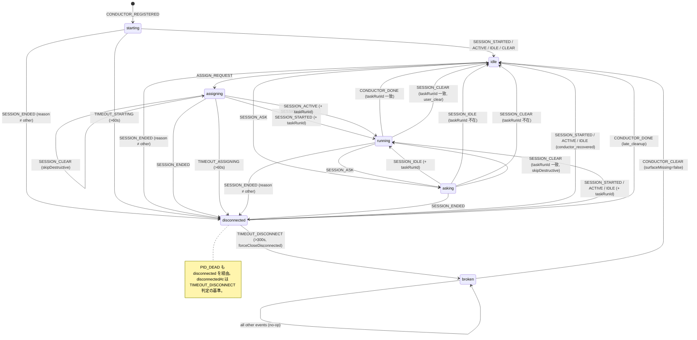

# T262 実装計画: Conductor 状態機械の純粋関数抽出（Phase 1）

> **v2 更新**: Design Review（`design-review.md`）の Blocker 3 項 + Major 5 項 + Minor 6 項を反映。B2 は「fail-stop effect を transition() の外に出す」を採用。各セクションの変更箇所は冒頭に「（v2 で更新）」と記す。

> **スコープ**: 本計画は Phase 1（純粋関数 `transition()` 抽出 + 網羅テスト）に限定する。Phase 2（状態削減）と Phase 3（XState 等へのパッケージ移行）は別タスクで扱う。Phase 1 を走らせてから判断する方が精度が高く、scope 肥大による race 増加リスクを避けるため。

## 1. ゴール

- **純粋関数 `transition()` の新設**: `skills/cmux-team/manager/conductor-fsm.ts` に `transition(state, event): { next, effects }` を実装する。
- **現行代入の置換**: `daemon.ts` / `conductor.ts` に散在する `conductor.status = ...` を `applyTransition(conductor, event, ctx)` 経由に置換する（ただし B2 / B3 / §6 に基づき FSM 外に残す経路も明示）。
- **A014 遷移表 + 現行到達可能セルの網羅テスト**: `conductor-fsm.test.ts` で A014 記載の 25 遷移に加え、現行 `handleMessage` で到達可能な未記載セル（`asking`/`starting`/`assigning` + `SESSION_ENDED` 等）と T250 で追加された `broken` 状態周りの遷移をテーブル駆動でカバーする（M2/M3）。
- **破壊的変更なし**:
  - 外部インターフェース（CLI フラグ、message 型、team.json / task-state.json の schema）は不変。
  - ログフォーマット（`conductor_ready`, `conductor_running`, `conductor_recovered`, `session_clear_expected` 等のイベント名と key=value 形式）も不変（detail 文字列は effect runner 側で既存の `formatConductorSnapshot` 等を呼んで組み立てる。M1）。
  - 既存の public export（`handleMessage` の signature 等）を保つ。

**Phase 1 は純粋化・テスト化のみ**を行い、状態セットや guard ロジックの意味変更は行わない。

## 2. 設計

### 2.1 型定義（v2 で更新: B1 / M1 反映）

```ts
// conductor-fsm.ts
export type ConductorStatus = ConductorState["status"];
// = "starting" | "assigning" | "idle" | "running" | "asking" | "disconnected" | "broken"

/** transition() に渡す最小限の state スナップショット */
export interface FsmState {
  status: ConductorStatus;
  taskRunId?: string;
  startedAt: string;             // ISO 8601 (タイムアウト判定用)
  disconnectedAt?: string;       // ISO 8601
  pid?: number;
  sessionId?: string;
  askQuestion?: string;
  lastHookAt?: string;
}

/** イベント (discriminated union) */
export type FsmEvent =
  // hook 由来
  | { type: "SESSION_STARTED"; source?: "startup" | "resume" | "clear" | "compact"; pid: number; sessionId?: string; at: string }
  | { type: "SESSION_IDLE"; pid?: number; at: string }
  | { type: "SESSION_ACTIVE"; pid?: number; at: string }
  | { type: "SESSION_ASK"; question: string; pid?: number; at: string }
  // B3: surface 実在確認は呼び出し側で済ませ、結果を event に含める
  | { type: "SESSION_CLEAR"; taskRunId?: string; pid?: number; surfaceMissing?: boolean; at: string }
  | { type: "SESSION_ENDED"; reason?: string; pid?: number; at: string }   // reason="other" は呼び出し側で事前に弾く
  // daemon 内部
  | { type: "CONDUCTOR_REGISTERED"; at: string }
  | { type: "CONDUCTOR_DONE"; taskRunId?: string; at: string }
  // B1: broken → idle の唯一の復帰パス。surface 実在確認の結果も持たせる
  | { type: "CONDUCTOR_CLEAR"; reason?: string; surfaceMissing?: boolean; at: string }
  | { type: "ASSIGN_REQUEST"; taskRunId: string; at: string }
  | { type: "ASSIGN_FAILED"; kind: "conductor" | "task"; at: string }
  | { type: "PID_DEAD"; pid: number; at: string }
  | { type: "TIMEOUT_STARTING"; elapsedSec: number; at: string }
  | { type: "TIMEOUT_ASSIGNING"; elapsedSec: number; at: string }
  | { type: "TIMEOUT_DISCONNECT"; elapsedSec: number; at: string };

/** Effect (discriminated union) — transition() は state を mutate せず副作用の宣言のみ返す */
export type FsmEffect =
  // M1: log effect は detail 文字列ではなく「event 名 + 参照コンテキスト」を返す。
  // detail の組み立ては effect runner 側で formatConductorSnapshot 等を呼ぶ。
  | { type: "log"; event: string; ctx?: LogCtx }
  | { type: "notifyStateChanged"; source: string }               // eventBus 経由
  | { type: "setPid"; pid: number | undefined }
  | { type: "setSessionId"; sessionId: string | undefined }
  | { type: "setDisconnectedAt"; at: string | undefined }
  | { type: "setAskQuestion"; question: string | undefined }
  | { type: "setLastHookAt"; at: string }
  | { type: "spawnPidWatcher"; pid: number }
  | { type: "clearPidWatcher" }
  | { type: "updateTaskSession"; sessionId: string }              // task-state.json.sessionId 更新
  // m2: broken → idle 復帰で scanTasks を走らせるために requestWakeup を effect にする
  | { type: "requestWakeup"; reason: string }
  // 以下「destructive」effect は B2 の決定により applyTransition の内側では実行しない。
  // transition() が effect として返し、**呼び出し側（handleMessage / monitorConductors）** で
  // 実行タイミングを制御する（§3 Step 4 参照）。
  | { type: "abortTask"; taskRunId: string; journal: string }
  | { type: "resetConductor"; targetStatus: "idle" | "broken"; reason?: string }
  | { type: "forceCloseDisconnected" }
  | { type: "skipDestructive"; reason: string };                  // assigning 中の SESSION_CLEAR 等、no-op を明示

/** log effect の構造化 ctx。effect runner 側で detail 文字列を組み立てる */
export interface LogCtx {
  elapsedSec?: number;
  trigger?: string;
  reason?: string;
  taskRunId?: string;
  sessionId?: string;
  prevStatus?: ConductorStatus;
  nextStatus?: ConductorStatus;
  source?: string;
  // detail 生成時に conductor snapshot (formatConductorSnapshot) を追加で呼ぶかどうか
  includeSnapshot?: boolean;
}

export interface TransitionResult {
  next: Pick<FsmState, "status" | "taskRunId" | "disconnectedAt" | "pid" | "sessionId" | "askQuestion" | "lastHookAt">;
  effects: FsmEffect[];
}

export function transition(state: FsmState, event: FsmEvent): TransitionResult;
```

### 2.2 guard 条件の扱い

A014 §2 の遷移表で guard が登場するのは主に以下 3 種:

| guard 種別 | 例 | 扱い |
|-----------|----|------|
| **状態 + イベントで決まる** | `assigning → running` は `SESSION_IDLE` + `taskRunId truthy` | `transition()` 内に吸収（state.taskRunId を見る） |
| **経過時間（タイムアウト）** | starting 60s / assigning 60s / disconnected 300s | daemon 側（`monitorConductors`）で経過時間を計算し `TIMEOUT_*` イベントとして発火 |
| **PID 生存** | `PID_DEAD` | daemon 側（`spawnPidWatcher`）が `process.kill(pid, 0)` を実行し、不在時のみ `PID_DEAD` を発火 |
| **surface 生存**（v2 追加） | `SESSION_CLEAR` / `CONDUCTOR_CLEAR` 時の surface_missing | daemon 側（`handleMessage`）で `cmux.getPaneForSurface` を事前実行し、結果を event.surfaceMissing として渡す（B3） |

**原則**: guard の決定論的計算（時刻差・PID 確認・surface 実在）は呼び出し側で済ませて**事実としてのイベント**を渡す。`transition()` は state.x と event.type/.surfaceMissing 等の組だけで next を決定する純粋関数とする。これにより:

- テストでは fake timer / cmux モックなしで境界条件をテストできる（`elapsedSec: 61` / `surfaceMissing: true` を直接渡す）。
- `Date.now()` / `process.kill` / `cmux.getPaneForSurface` 等の副作用ソースが `transition()` に入り込まない。

### 2.3 hook signal → event のマッピング方針

**結論: そのまま 1:1 でマッピングする（正規化しない）**。

- A014 の遷移表は hook signal 名（`SESSION_STARTED` 等）を key として整備されている。マッピングを変えるとテーブルと乖離する。
- `SessionStop hook → classifyStopPayload → SESSION_ASK / SESSION_IDLE` の再合成は**既に handleMessage 入口の前段**で行われている（daemon.ts の `classifyStopPayload` 経由、A014 §2.1）。`transition()` は合成後のイベントのみ受け取れば良い。
- **`SESSION_ENDED reason=other` は `transition()` に到達させない** — `handleMessage` 入口で `insertHookSignal` による記録を行った後、classify で `reason=other` と判定された時点で `session_ended_other_ignored` ログを出して早期 return する。v2 追記（m4）: 全体のデータフローは以下。

```
hook POST → handleMessage(入口)
  ├── insertHookSignal(DB 記録) ★必ず実行（CLAUDE.md「hook 全送信ポリシー」）
  ├── classifyStopPayload (SESSION_STOP → SESSION_ASK | SESSION_IDLE)
  ├── classify reason=other → ログのみ（session_ended_other_ignored）early return
  └── applyTransition(conductor, event, ctx) へ
```

- 将来 event を増やす際は discriminated union への追加で済む。

例外: `CONDUCTOR_REGISTERED` / `CONDUCTOR_DONE` / `CONDUCTOR_CLEAR` は hook 由来ではなく Conductor プロセスからの直接 POST だが、`transition()` から見れば同じイベントとして扱う。

### 2.4 `broken` 状態の扱いと Mermaid 図（v2 で更新: B1 / m5）

A014 は v3.53.0 時点の調査なので 6 状態（`broken` 以前）。現行 schema.ts は T250 で導入された `broken` を含む 7 状態。**plan.md ではこの差分を吸収する**:

- A014 の「遷移 23: disconnected → (idle via forced cleanup)」は現行では **disconnected → broken**（`forceCloseDisconnectedConductor` が `status=broken` を set、cleanup 実施後もユーザーの `cmux-team clear-conductor` まで保持）。
- `broken` からの復帰は `CONDUCTOR_CLEAR` event（`daemon.ts:handleMessage` の CONDUCTOR_CLEAR case）のみ。hook signal は `broken` 中は全て no-op（`daemon.ts:1291, 1345, 1702, 1789, 1945` の `if (conductor.status === "broken")` early return）。
- T251 で追加された「`resetConductor` 内部での surface_missing → broken 昇格」は、B3 に基づき **transition() ではなく handleMessage / monitorConductors 側で surface 実在確認した結果を event.surfaceMissing として渡す**設計に変更する（§3 Step 4 参照）。

#### 差分 Mermaid 図



## 3. 実装ステップ（TDD）

### Step 1: 型定義と空実装

`conductor-fsm.ts` に型定義（§2.1）と以下のスケルトンを置く:

```ts
export function transition(state: FsmState, event: FsmEvent): TransitionResult {
  return { next: { ...state }, effects: [] };  // 全パススルー
}
```

この時点で `bun build` / `tsc --noEmit` が通ることを確認。

### Step 2: テーブル駆動テストの作成（テスト先行。v2 で網羅対象拡張: M2/M3）

`conductor-fsm.test.ts` を新規作成。以下の構造で **A014 §2 の 25 行 + 現行 `handleMessage` で到達可能な未記載セル + `broken` 関連** を case として列挙する:

```ts
type Case = {
  name: string;
  from: Partial<FsmState>;    // 既定値: { status, startedAt: "2026-01-01T00:00:00Z" }
  event: FsmEvent;
  expectTo: ConductorStatus;
  // v2: effects は階層化された matcher を使う (§5.1 M5 参照)
  expectEffects: {
    destructive?: FsmEffect[];      // 型と相対順序まで完全一致
    logs?: string[];                 // event 名の存在のみ (順序不問)
  };
};
```

#### 網羅対象（v2 で拡張）

1. **A014 §2 の行 #1〜#25（25 ケース）** — 従前通り。
2. **現行 `handleMessage` の到達可能セル（A014 未記載）**:
   - `asking` + `SESSION_ENDED` → `disconnected`（`daemon.ts:1624-1648`, status guard なし）
   - `asking` + `SESSION_CLEAR` taskRunId 一致 → `asking` 維持 + `skipDestructive`
   - `asking` + `SESSION_CLEAR` taskRunId 不在 → `idle`
   - `starting` + `SESSION_ENDED` → `disconnected`（現行条件なし）
   - `assigning` + `SESSION_ENDED` → `disconnected`（destructive 非発生）
   - `SESSION_ENDED` + `surface mismatch` → no-op + `session_ended_ignored` ログ（`daemon.ts:1627-1633` 相当）
   - `disconnected` + `CONDUCTOR_DONE` taskRunId 一致 → `idle` + `resetConductor`（M2 の late_cleanup 経路）
   - `idle` + `CONDUCTOR_DONE` → no-op + `no_task` ログ
   - `broken` + `AGENT_SPAWNED` 相当の観測ログ（m3 — `broken_conductor_still_alive` は **FSM 外**に残すため case には含めず `handleMessage` の責務として plan §6 で明記）
3. **`broken` 関連**:
   - `disconnected` + `TIMEOUT_DISCONNECT (301)` → `broken` + `forceCloseDisconnected`
   - `broken` + 全 hook signal → no-op（status 変更なし、`broken_conductor_signal_ignored` ログのみ）
   - `broken` + `CONDUCTOR_CLEAR (surfaceMissing=false)` → `idle` + `resetConductor (targetStatus=idle)` + `requestWakeup`（B1 / m2）
   - `broken` + `CONDUCTOR_CLEAR (surfaceMissing=true)` → `broken` 維持 + `resetConductor (targetStatus=broken, reason=surface_missing)` （B3 — surface 実在確認は呼び出し側で済ませている前提）
4. **A014 §2.1「遷移を起こさないシグナル」**:
   - `AGENT_SPAWNED` は transition() の引数型に含まれない（型エラーで弾かれる）— case 対象外。
   - `SESSION_ENDED reason=other` は呼び出し側で弾く前提を test 内で assert（「reason=other を transition に渡した場合は throw する」 or 「to reach transition, caller must filter」のいずれかを policy として明記し、前者なら case に含める）。v2 選択: **transition 側で reason=other の場合は effects 空・status 維持（防衛実装）**。
   - `SESSION_STOP` は classify 済み前提（型エラーで弾かれる）。
5. **T250/T251/T254/T255/T260/T261 race fix 経路** — §5.3 の stale taskRunId ガード / §5.4 冪等性テストに含める。

この段階ではテストは全 RED。case 総数は概算で **45〜55 ケース**（A014 25 + 到達可能未記載 約 8〜10 + broken 関連 約 10）。

### Step 3: `transition()` の実装

A014 §2 の遷移表と daemon.ts の既存ロジックを照合しながら switch で実装。状態ごとにネストした switch（`switch (state.status)` → `switch (event.type)`）で記述する。Test が全 GREEN になることを確認。

### Step 4: effect runner の実装（v2 大幅改訂: B2 / B3 反映）

B2 の決定: **fail-stop effect（destructive）は `applyTransition` の内側で実行せず、呼び出し側で制御する**。

#### 選定理由

3 案（effect-first / snapshot rollback / fail-stop 除外）を比較:

| 案 | メリット | デメリット | 評価 |
|----|---------|-----------|------|
| effect-first | rollback 不要 | ログ順序が現行（status 更新 → log → resetConductor）と変わる。既存統合テストが多数 red |  ✗ |
| snapshot rollback | ログ順序維持 | state の深いコピーが必要、rollback 時の disconnectedAt 追加書き込みで effect が二重に積まれる、テストが複雑化 |  △ |
| **fail-stop 除外** | **現行挙動・ログ順序を完全維持。transition() の純粋性が最大化。`main.ts:798` / `conductor.ts:605` の据え置き方針と一貫** | applyTransition の責務が「非 destructive effect の即時実行」に限定され、呼び出し側で destructive effect を拾う boilerplate が増える |  **✓（採用）** |

**採用根拠の補足**: destructive effect は元々 try/catch の粒度・リカバリ方針（disconnected に倒す / broken に倒す）が呼び出し元の文脈（`handleMessage` vs `monitorConductors`）で異なる。FSM に載せるよりも「FSM は意思決定、呼び出し側は副作用実行と例外処理」の境界を明確に保つ方が保守性が高い。これは plan.md §6 が `resetConductor` と `main.ts:798` を据え置きにしている方針と同じ哲学。

#### `applyTransition` 新設計

```ts
export interface FsmContext {
  log: (event: string, detail: string) => Promise<void>;
  notifyStateChanged: (source: string) => void;
  spawnPidWatcher: (pid: number) => void;
  clearPidWatcher: (conductor: ConductorState) => void;
  updateTaskSession: (taskRunId: string, sessionId: string) => Promise<void>;
  requestWakeup: (state: DaemonState) => void;
  formatSnapshot: (conductor: ConductorState) => string;   // detail 組み立てで使う
}

export async function applyTransition(
  conductor: ConductorState,
  event: FsmEvent,
  ctx: FsmContext,
): Promise<FsmEffect[]> {
  const { next, effects } = transition(toFsmState(conductor), event);
  // (a) 非 destructive effect を即時実行（log / notifyStateChanged / spawnPidWatcher 等）
  const remaining: FsmEffect[] = [];
  for (const e of effects) {
    if (isDestructive(e)) {
      remaining.push(e);
      continue;
    }
    await runNonDestructiveEffect(e, conductor, ctx);
  }
  // (b) state mutation を commit（destructive 未実行の時点では現行挙動と同じ順序）
  commitState(conductor, next);
  // (c) destructive effect は呼び出し側に返す
  return remaining;
}

function isDestructive(e: FsmEffect): boolean {
  return e.type === "resetConductor"
    || e.type === "abortTask"
    || e.type === "forceCloseDisconnected";
}
```

`commitState` は `conductor.status = next.status` 等を一括適用する（現行の個別代入と同順）。

#### 呼び出し側（handleMessage 等）の典型パターン

```ts
// SESSION_CLEAR + running (user_clear) のケース
const event: FsmEvent = {
  type: "SESSION_CLEAR",
  taskRunId: message.taskRunId,
  pid: message.pid,
  surfaceMissing: await isSurfaceMissing(conductor, workspace),  // B3: 事前確認
  at: message.timestamp,
};
const destructive = await applyTransition(conductor, event, ctx);
// destructive effect を try/catch 付きで実行（現行の catch ブロックと同じリカバリ）
try {
  for (const e of destructive) {
    await runDestructiveEffect(e, conductor, ctx, projectRoot, workspace);
  }
} catch (e) {
  // 現行挙動と同じ: status は既に commit 済みなので、ここで disconnected に倒す
  conductor.status = "disconnected";
  conductor.disconnectedAt = new Date().toISOString();
  await log("destructive_effect_failed", formatExecError(e));
}
```

**`runDestructiveEffect` は既存の `resetConductor` / `abortTask` / `forceCloseDisconnectedConductor` をそのまま呼ぶ薄いアダプタ**。新規ロジックは書かない。

#### B3 の surface_missing 責務分離

- 呼び出し側（`handleMessage` の `CONDUCTOR_CLEAR` / `SESSION_CLEAR` case、`monitorConductors` の forced close 経路）で `cmux.getPaneForSurface(conductor.surface, workspace)` を先に実行する。
- 結果を event の `surfaceMissing: boolean` として transition に渡す。
- transition は `surfaceMissing === true` なら `next.status` を `broken` 維持、かつ effects に `{ type: "resetConductor", targetStatus: "broken", reason: "surface_missing" }` を含める。
- effect runner 側の `resetConductor` は `opts.targetStatus` をそのまま使う（現行の内部昇格ロジックは維持されるが、呼び出し時点で `targetStatus` が既に `broken` になっているため FSM の `next.status` と必ず一致する）。
- **T251 の `resetConductor` 内部昇格コードは削除しない**（呼び出し側が surface 確認を忘れた場合の fail-safe として残す。ただし Phase 1 完了後に全呼び出し箇所が確認済みかを §6 でレビューする）。

#### M1 の log effect 生成

effect runner の `runNonDestructiveEffect` 内で log を処理:

```ts
case "log": {
  const detail = buildLogDetail(e.event, e.ctx, conductor, ctx.formatSnapshot);
  await ctx.log(e.event, detail);
  break;
}
```

`buildLogDetail` は event 名ごとに既存の detail フォーマットを再現する薄い関数。例:

```ts
function buildLogDetail(event: string, lctx: LogCtx | undefined, conductor: ConductorState, fmt: (c: ConductorState) => string): string {
  switch (event) {
    case "conductor_disconnected":
      return `${fmt(conductor)} elapsed=${lctx?.elapsedSec ?? "?"}s`;
    case "conductor_recovered":
      return `surface=${conductor.surface} prev=${lctx?.prevStatus} trigger=${lctx?.trigger}`;
    // ...
  }
}
```

### Step 5: `daemon.ts` / `conductor.ts` の代入を置換（v2 で順序更新）

`handleMessage` 内の各 case branch を以下の形に置換:

```ts
// before
conductor.status = "running";
conductor.disconnectedAt = undefined;
conductor.pid = message.pid;
await log("conductor_running", `...`);
notifyStateChanged("daemon.ts:handleMessage:session-started-conductor");

// after
const destructive = await applyTransition(conductor, {
  type: "SESSION_STARTED",
  source: message.source,
  pid: message.pid,
  sessionId: message.sessionId,
  at: message.timestamp,
}, ctx);
// SESSION_STARTED は destructive effect を生成しないので返り値は空配列のはず（assert で担保）
if (destructive.length > 0) throw new Error(`unexpected destructive effect on SESSION_STARTED`);
```

#### 置換順序（現状 grep 結果に基づき更新）

現行 `conductor.status = "..."` 代入箇所（`rg` 結果より確定）:

- **daemon.ts**: 1352, 1359, 1634, 1711, 1714, 1719, 1800, 1811, 1818, 1822, 1827, 1885, 1962, 2195, 2207, 2221, 2258, 2457, 2472（19 箇所）
- **daemon.ts:916**: `c.status = "idle"`（初期 pane 復元経路 — §6 で FSM 外に据え置き判断を再検討）
- **conductor.ts**: 444（assigning）、605（resetConductor の targetStatus）
- **main.ts:798**: `c.status = "running"`（team.json 復元経路 — FSM 外据え置き）

※ **本 Phase では master / agent / proxy の status 代入は対象外**（T262 本文「Conductor 状態機械」に限定）。

置換ステップ:
1. `CONDUCTOR_REGISTERED`（新規 map 登録 + idempotent merge 分岐は handleMessage に残す。m1）
2. `CONDUCTOR_DONE`（`daemon.ts` L1350-L1370 周辺、single + late_cleanup 両経路）
3. `SESSION_STARTED` / `SESSION_ACTIVE`（`daemon.ts` L1700-L1730, L1790-L1830）
4. `SESSION_IDLE` / `SESSION_ASK`（`daemon.ts` L1880-L1890）
5. `SESSION_CLEAR`（surface 確認 + `surfaceMissing` 付与、L1800 周辺）
6. `SESSION_ENDED`（reason=other の事前 filter、L1624-L1648）
7. `TIMEOUT_*` / `PID_DEAD`（`monitorConductors` L2450-L2490 + `spawnPidWatcher` L2258）
8. `CONDUCTOR_CLEAR`（B1 — L1238-L1265 相当、`broken → idle` の唯一経路）
9. `ASSIGN_REQUEST` / `ASSIGN_FAILED`（`conductor.ts:444` + `daemon.ts:2195/2207/2221`）

各 step 完了時に `bun test` を走らせ回帰検出する。commit はトピック単位で分ける。

### Step 6: 既存テストとの整合

- `daemon.test.ts`: state 遷移を直接 assert しているテスト（例: L285 "SESSION_IDLE は conductor.status を変更しない"）を棚卸し。これらは `handleMessage` の統合テストなので**残す**（applyTransition 経由でも同じ結果が出ることを確認するため）。
- `conductor.test.ts` L153「assignTask 成功後に conductor.status === 'assigning'」も残す。
- **`conductor-fsm.test.ts` は純粋関数単位の新規テスト**として並存させる。重複感があっても統合と単体の両方で回帰検出したいので OK。

### Step 7: ビルド・テスト確認

```bash
cd skills/cmux-team/manager
bun install
bun test               # 既存テスト + conductor-fsm.test.ts が全緑
bunx tsc --noEmit      # 型エラー無し
```

## 4. リスクと回避策

### R1: effect 実行中の例外（v2 で書き直し: B2 反映）

B2 決定により、destructive effect は `applyTransition` の外（呼び出し側）で try/catch する。A015 の分類に従う:

- **fail-stop に倒す effect**（destructive、applyTransition 返り値として呼び出し側が実行）: `resetConductor` / `abortTask` / `forceCloseDisconnected`。例外時は呼び出し側の catch で status を `disconnected` に倒す（現行挙動と同じ）。**state は既に commit 済み**だが、destructive 未実行の時点での status は「現行の代入 → log → resetConductor 呼び出し直前」と同等のため、catch の復旧ロジックも現行と同じで良い。
- **best-effort に倒す effect**（非 destructive、applyTransition 内で即時実行）: `log`, `notifyStateChanged`, `updateTaskSession`, `spawnPidWatcher`, `clearPidWatcher`, `setXxx`, `requestWakeup`。例外は swallow（既存 `daemon.ts` の catch と揃える）。
- **例外時の disconnectedAt 整合**: 現行は destructive 失敗時に呼び出し側の catch で明示的に `disconnectedAt = now` を set している。新設計でも同じ明示代入を残す（`commitState` が書いた値に上書き）。テストで以下を assert:
  - `SESSION_CLEAR + running` で destructive が throw → 最終 status=disconnected, disconnectedAt=now, pid 残留なし

### R2: 段階的移行中の既存挙動破壊

Step 5 の順序に従い、case branch ごとに置換する。1 PR で全置換してもよいが、順序を固定する（上記 9 ステップ）。

各 step 完了時に `bun test` を走らせ回帰検出する。commit はトピック単位で分ける。

### R3: テスト配置の一貫性（v2 で M5 反映）

`conductor-fsm.test.ts` と `daemon.test.ts` / `conductor.test.ts` の責務を以下に明確化:

| テストファイル | カバー範囲 | effect 検証方針（M5） |
|---------------|-----------|---------------------|
| `conductor-fsm.test.ts`（新規） | `transition()` の state×event 全組み合わせ、effect の型と相対順序 | destructive は型と順序まで一致、log は event 名の存在のみ、notifyStateChanged は検証しない |
| `daemon.test.ts` | `handleMessage` 統合（FSM + effect runner + 既存 I/O）、message routing、例外リカバリ | ログ文字列完全一致は最小限に、状態遷移と外部副作用の呼び出し回数で検証 |
| `conductor.test.ts` | `assignTask` / `resetConductor` の外部副作用（cmux コマンド、file I/O） | 現行通り |

README 等には記載しない（内部実装詳細のため）。

### R4: hook_signals / trace との整合

`hook_signals` テーブル挿入（`insertHookSignal`）は `handleMessage` の入口で行われる（CLAUDE.md「hook 全送信ポリシー」）。これは **`applyTransition` の外側**で維持する。純粋関数に DB 依存が侵入しないようにする。m4 で図示したデータフローを参照。

### R5: B3 の surface 実在確認が呼び出し側の boilerplate を増やす（v2 追加）

- 呼び出し側が surface 確認を書き忘れた場合の fail-safe として、`resetConductor` 内部の T251 昇格コードは Phase 1 では残す。
- Phase 2 で全呼び出し箇所を監査し、残置コード削除を検討する（§6 参照）。
- 性能面: `cmux.getPaneForSurface` は tree 取得を要するため、高頻度 handler（SESSION_IDLE 毎 tick 等）では呼ばない方針。SESSION_CLEAR / CONDUCTOR_CLEAR のような低頻度 destructive 経路に限定する。

## 5. テスト戦略

### 5.1 表駆動テスト（必須。v2 で検証階層化: M5）

case 総数 約 45〜55。各 case で以下を検証:

- **必須**: `result.next.status` === expected
- **必須**: `result.next.disconnectedAt` / `pid` / `sessionId` の set/clear が仕様通り（遷移表「副作用」列準拠）
- **必須**: `result.effects` のうち destructive（`resetConductor` / `abortTask` / `forceCloseDisconnected` / `updateTaskSession` / `spawnPidWatcher` / `requestWakeup`）の **型と相対順序** を完全一致で検証（資源取得系 → 破壊系 の order）。
- **任意**: log effect は **event 名の存在** のみ検証（`expect(effects).toContainEqual(expect.objectContaining({ type: "log", event: "conductor_ready" }))`）。順序は検証しない。
- **不要**: log ctx の各フィールド値（`buildLogDetail` の責務）、`notifyStateChanged` の source 文字列、`setXxx` effect の細部。

**理由**: T260 のような「`conductor_disconnected` を出す順序（pid クリア前後）の小刻みな調整」でテーブルテストが red になる運用を避ける。保守コストが実装メリットを上回らないようにする。

### 5.2 境界条件テスト

- `TIMEOUT_STARTING`: `elapsedSec: 60` は starting 維持、`61` で disconnected 遷移
- `TIMEOUT_ASSIGNING`: 同様
- `TIMEOUT_DISCONNECT`: `300` は disconnected 維持、`301` で broken 遷移 + `forceCloseDisconnected` effect（destructive のため必須検証）
- `SESSION_CLEAR` + `assigning`: effects に `skipDestructive` のみ含まれること（destructive effect が含まれないこと）
- `SESSION_CLEAR` + `running` + `taskRunId` 不一致: destructive スキップ
- `SESSION_CLEAR` + `running` + `surfaceMissing=true`: status=broken + `resetConductor (targetStatus=broken)` destructive（B3）
- `CONDUCTOR_CLEAR` + `broken` + `surfaceMissing=false`: status=idle + `resetConductor (targetStatus=idle)` + `requestWakeup`（B1/m2）

### 5.3 stale taskRunId ガード

A014 §5.5 記載の 3 ガード（`CONDUCTOR_DONE` / `SESSION_CLEAR` / `SESSION_STARTED` の `task_session_updated`）を個別 case でテスト。片側 undefined は互換のため通すことも個別テストで固定化。

### 5.4 冪等性

- `CONDUCTOR_REGISTERED` を同一 surface に 2 回発火 → 2 回目は no-op（transition() には既存 state を渡す想定。新規 map 登録は handleMessage 側の責務。m1）
- `broken` 状態での全 hook signal → no-op（effects に status 変更が含まれない、`broken_conductor_signal_ignored` ログのみ）
- `broken` + `CONDUCTOR_CLEAR (surfaceMissing=true)` を繰り返し発火 → broken 維持（effects に status 変更なし）

### 5.5 非対象（明示。v2 更新: m4）

- `AGENT_SPAWNED` は Conductor FSM の遷移を起こさないため（A014 §2.1）、本テストでは扱わない。Agent state machine は別途（Phase 2 以降）。ただし **`broken_conductor_still_alive` 警告ログ（`daemon.ts:1288-1296`）は `handleMessage` に残す** — FSM 化の過程で消失しないよう §6 付録に明記（m3）。
- `SESSION_STOP` は classify 後に handleMessage に再入する前提なので、本 FSM では扱わない。
- `SESSION_ENDED reason=other` は `handleMessage` が `session_ended_other_ignored` ログを出して early return する（m4）。transition に到達した場合の防衛実装として `effects=[]` / `next=state` を返すケースも 1 件テスト。
- `MASTER_REGISTERED` / master 系 status 代入は対象外。

### 5.6 PID_DEAD の stale ガード（v2 追加: m6）

現行 `__testSpawnPidWatcherTick`（`daemon.ts:2254-2276`）は `conductor.pid !== pid` のとき `stale` を返し state を触らない。FSM 化後も以下のテストを追加:

- `PID_DEAD + pid mismatch` → state / effects とも no-op（stale 判定は **transition() 内の guard** として実装。`state.pid === event.pid` チェックを transition の冒頭に入れる）
- `PID_DEAD + pid match` → status=disconnected + `disconnectedAt=event.at` + `clearPidWatcher` effect

## 6. 対象ファイル一覧

### 新規

- `skills/cmux-team/manager/conductor-fsm.ts` — 型定義 + `transition()` + `applyTransition()` + `runNonDestructiveEffect()` + `buildLogDetail()`
- `skills/cmux-team/manager/conductor-fsm.test.ts` — 表駆動テスト

### 修正

- `skills/cmux-team/manager/daemon.ts` — `handleMessage` 内の Conductor 関連 case branch を `applyTransition` 呼び出しに置換。destructive effect は呼び出し側で実行（§3 Step 4 参照）。`monitorConductors` の timeout 判定も同様。
- `skills/cmux-team/manager/conductor.ts` — `assignTask`（L444 `conductor.status = "assigning"`）を `applyTransition(_, { type: "ASSIGN_REQUEST", ... })` に置換。

### 据え置き（FSM 外残置代入）— v2 で付録化: M4

`rg -n "conductor\.status\s*=\s*" skills/cmux-team/manager` の全件（2026-04-19 時点）に対してタグ付与:

| ファイル:行 | 現行コード | タグ | 理由 |
|------------|----------|------|------|
| `main.ts:798` | `c.status = "running"` | **恒久残置** | team.json 復元経路。daemon 起動前の初期化で FsmState がまだ完全ではない。FSM event を発火する起動順序が複雑化するだけで利益が薄い |
| `daemon.ts:916` | `c.status = "idle"` | **Phase 2 で検討** | 同じく起動時の pane 復元経路。Phase 2 で「起動時の state 復元」を event 化する余地はあるが、優先度低 |
| `daemon.ts:1326` | `master.status = "idle"` | **対象外** | master FSM は Phase 2 以降 |
| `daemon.ts:1433` | `agent.status = "running"` | **対象外** | agent FSM は Phase 2 以降 |
| `daemon.ts:1605` | `master.status = "disconnected"` | **対象外** | master |
| `daemon.ts:1683` | `master.status = "running"` | **対象外** | master |
| `daemon.ts:1770` | `master.status = "idle"` | **対象外** | master |
| `daemon.ts:1855` | `agent.status = "idle"` | **対象外** | agent |
| `daemon.ts:1914` | `agent.status = "asking"` | **対象外** | agent |
| `daemon.ts:2032` | `agent.status = "running"` | **対象外** | agent |
| `daemon.ts:2383` | `master.status = "disconnected"` | **対象外** | master |
| `conductor.ts:605` | `conductor.status = targetStatus` | **fail-safe として残置** | B3 により呼び出し側で surface 確認済みだが、書き忘れ時の fail-safe として T251 昇格コードを残す（Phase 2 で全呼び出し箇所監査後に削除検討） |
| `proxy.ts:305, 307` | `master.status = ...` | **対象外** | master |

**Phase 1 で `applyTransition` 経由に置換する箇所** = 上記表の Conductor status 代入のうち `main.ts:798` / `daemon.ts:916` / `conductor.ts:605` を除く全て（合計 19 箇所、§3 Step 5 参照）。

### m3 で明示: FSM 化しない条件付き副作用（handleMessage 側に残す）

- `daemon.ts:1288-1296` の `broken_conductor_still_alive` 警告ログ（`AGENT_SPAWNED` 受信時に conductor が broken の場合）
- `daemon.ts` の `conductor_caller_alive` 系ログ（T260 関連）
- `insertHookSignal` 呼び出し（handleMessage 入口、全 hook signal で必ず実行）

これらは FSM 化しない。コードレビューで消失していないかを確認する。

### 据え置き

- `schema.ts` — 型の公開は既存 export を利用。本 Phase で新規 export 型は `conductor-fsm.ts` 内に閉じる。
- `agent` / `master` の status 代入 — 対象外。
- `proxy.ts` の master status 代入（L305/307）— 対象外。

## 7. フォローアップ候補（Phase 2 / 3、本タスクのスコープ外）

A014 の課題・A015 の方針・T250 の `broken` 実装・本計画での残置を踏まえ、以下が候補として挙がる。本 Phase 1 完了後に別タスクで扱う:

- **(a) 状態削減**: `starting`/`assigning` の統合検討、`asking` の sub-state 化、`disconnected` と `broken` の整理
- **(b) master / agent FSM の同型抽出**: 同じ `transition() + applyTransition` パターンを適用
- **(c) XState 等の外部ライブラリ導入の費用対効果評価**
- **(d) A015 に従った guard 強化**: assigning timeout の延長 / PID 生存との AND 判定、AGENT_SPAWNED を復帰 signal に採用する是非
- **(e) 残置代入の FSM 化**: `main.ts:798` / `daemon.ts:916` / `conductor.ts:605` の FSM 引き上げ検討
- **(f) B3 の fail-safe 削除**: `resetConductor` 内部の T251 昇格コードを、全呼び出し箇所が事前 surface 確認済みであることを確認してから削除

これらは Phase 1 のテストが揃い refactor の土台が固まってから判断する方が精度が高い。
