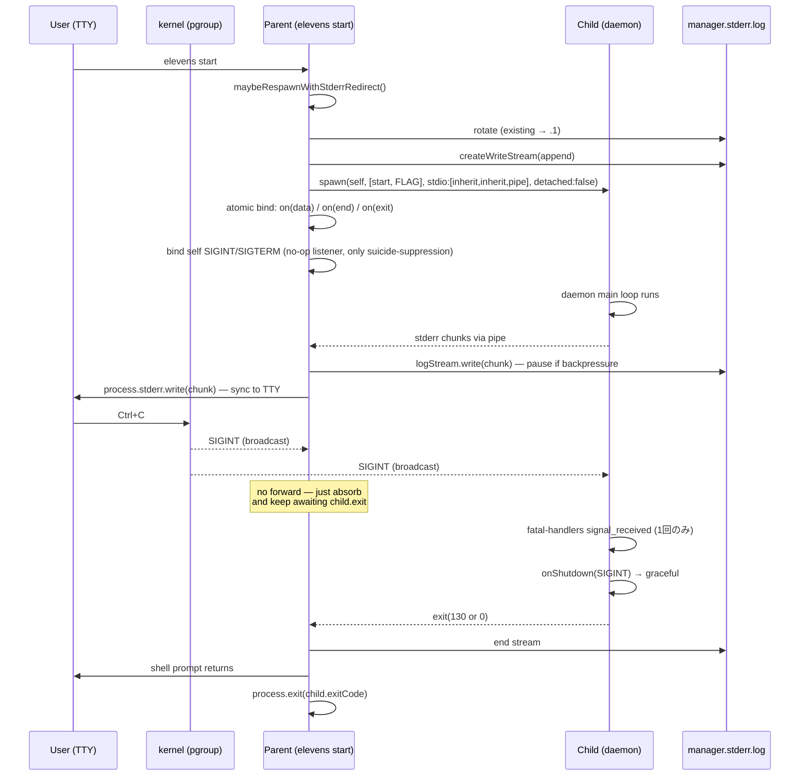
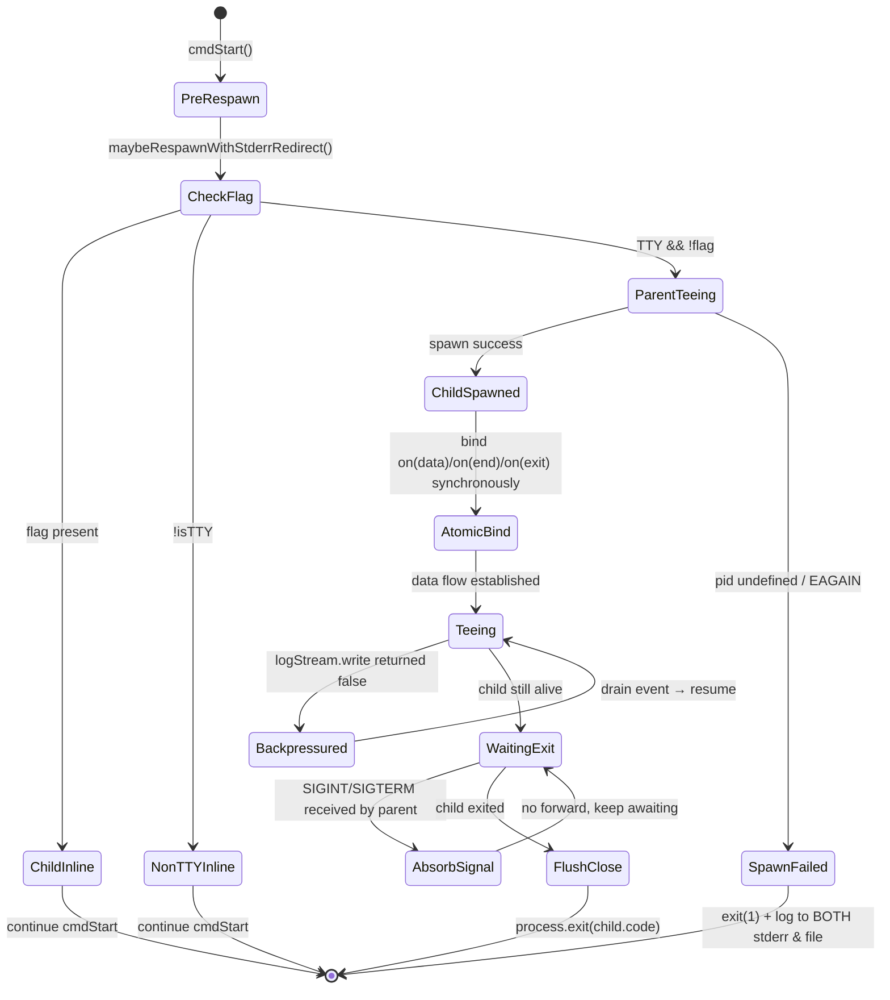
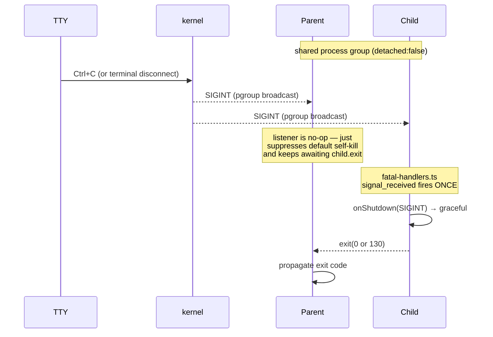

# T013 plan: post-mortem stderr の proper 実装 — parent tee で TTY 表示 + file 両立

> **改訂履歴**: design-review.md (Verdict: Changes Requested) の C1 / C2 / M1〜M4 / m2 / m3 / m5 を反映 (rev2)。
> 主要変更: signal forwarding を撤廃し process group broadcast に委ねる構造化 / `child_process.spawn` 採用を明文化 / backpressure を pause/resume + drain ベースに格上げ / reload 経路の TUI feedback 責務を spec §5.1 に明文化する方針 / atomic bind invariant を P2 の done 定義に追加 / spec §5 (a) に "TTY 親プロセス起動時のみ" の補足を追記。

## 概要

### ゴール

1. **Bun runtime panic / Rust crate panic / libc abort を `.team/logs/manager.stderr.log` に残せる**（v0.8.0 と同等の post-mortem evidence）
2. **`elevens start` を TTY で打った user に正常な stdout/stderr が見える**（v0.8.1 hotfix と同等の UX）
3. **子の起動失敗 (`daemon already running` 等) が TTY にも file にも両方表示される**
4. **`Ctrl+C` で daemon が正常 shutdown する**（v0.8.0 の detached child では Ctrl+C が届かなかった）。**かつ shutdown は 1 回しか走らない**（fatal-handlers の `signal_received` が二重発火しない）
5. **親プロセスは child の exit code を継承する**

### 非ゴール

- launchd plist / external sampler の導入（spec §9 D5 に基づき別タスク）
- stderr.log の多世代化（1 世代固定、spec §9 D3）
- non-TTY (CI / pipe) 経路での tee 動作（直 inline 起動で十分。`manager.stderr.log` への redirect は不要 — CI ログに stderr が出ていれば事後解析できる）
- reload 経路での TTY visibility — reload は TUI 内部の再起動であり、stderr は file に直 redirect する（v0.8.0 と同じ）
- systemd / nohup / launchctl 経由起動での post-mortem evidence (`manager.stderr.log`) — これは spec §5 (a) を「TTY 親プロセス起動時のみ」と明記して切り出す（後述 §変更ファイル一覧, m2 対応）

### v0.8.1 hotfix との関係

v0.8.1 で導入した `CMUX_TEAM_POST_MORTEM_REDIRECT=1` の opt-in env は本タスクで **廃止**する（後述 §公開 API 変更）。default で tee が効くので opt-in 経路は不要になる。

## アーキテクチャ

### API 選択 (M1 対応)

**`import { spawn } from "child_process"` を継続使用する** — `Bun.spawn` ではない。理由:

- tee の核心は `child.stderr.on("data", ...)` で chunk を捌くこと。これは Node `child_process` API の `stream.Readable` (`EventEmitter`) でしか自然に書けない。`Bun.spawn` の stderr は Web Streams (`ReadableStream`) で `EventEmitter` ではないため、本タスクで採用すると pause/resume / drain dispatcher の書き味が大きく変わる
- 現行 `post-mortem-redirect.ts:23` および `reload.ts:21` がすでに `child_process.spawn` を import している。本タスクでもそれを維持する
- §リスクと対策 R6 は「`child_process.spawn` を Bun ランタイム上で動かしたときの挙動差」と読み替える（旧表現の "bun.spawn" は誤記）

### 採用方針: parent tee アーキテクチャ + signal は process group broadcast に委ねる (C1 / C2 対応)

`cmdStart` 冒頭の `maybeRespawnWithStderrRedirect()` を **parent tee** 方式に書き換える。**親は child に signal を forward しない** — kernel が同一 process group の全プロセスに broadcast するのを利用し、`fatal-handlers.ts` の `signal_received` listener が二重発火しないことを構造的に保証する。

**親プロセス** (TTY あり、flag なし):

1. `.team/logs/manager.stderr.log` を rotate (`.1` に世代退避) — 既存 `rotateStderrLog()` を流用
2. `createWriteStream(stderrLogPath, { flags: "a" })` で append stream を open
3. `spawn(self, args + FLAG, { stdio: ["inherit", "inherit", "pipe"], detached: false, env, cwd })` で子を foreground spawn
   - `detached: false` により親と child は同じ process group に属する
4. **spawn 戻り値受け取り直後に同期 bind** (M4 atomic invariant):
   - `child.stderr.on("data", chunk => …)`
   - `child.stderr.on("end", () => …)`
   - `child.on("exit", (code, signal) => …)`
   - `await` / 別ロジックを挟まずに 3 つを連続して bind し、初回 chunk / 早期 exit を取りこぼさない
5. data listener で **tee + backpressure 制御** (M2 対応, R1 再設計):

   ```ts
   child.stderr.on("data", (chunk) => {
     const okToLog = logStream.write(chunk);
     processStderrWriteImpl(chunk); // TTY 前提なので同期 block (m5)
     if (!okToLog) {
       child.stderr.pause();
       logStream.once("drain", () => child.stderr.resume());
     }
   });
   ```

   pause/resume を併用するのが鍵 — Node の `Readable` は data event を発火し続けるためメモリ上に chunk が積み上がる。`logStream.write` 戻り値だけ見る dispatcher では Bun runtime panic で数 MB の backtrace を一気に出されたケースで RSS 急増する。
6. **parent は signal を forward しない**:
   - `process.on("SIGINT", () => { /* 自殺抑止のみ。child は kernel broadcast で同じ signal を受け取り済み */ })`
   - `process.on("SIGTERM", () => { /* 同上 */ })`
   - **SIGHUP は listen しない** — TTY 切断時に kernel が pgroup 全員に broadcast するので、child 側で自然に shutdown する。親はやがて child の exit を観測して exit code を継承して終わる
   - これにより `fatal-handlers.ts:84-102` の listener が child 側で 1 回しか発火しないことが構造的に保証される
7. `await new Promise<{code, signal}>(resolve => child.on("exit", (code, signal) => resolve({code, signal})))` で child の終了を待機
8. logStream を `await new Promise(r => logStream.end(r))` で flush close
9. `process.exit(child.exitCode ?? (signal ? 128 + signalNo : 1))` で exit code 継承

**子プロセス** (flag あり / stderr が pipe):

- 現状コードと同じく `maybeRespawnWithStderrRedirect` は no-op return → 通常 init 続行
- stderr に write した内容はすべて pipe 経由で親に届き、親が file + TTY に tee
- kernel broadcast の SIGINT / SIGTERM / SIGHUP は `fatal-handlers.ts` の既存 listener が受け、`onShutdown(signal)` を 1 回だけ起動する

**non-TTY 親** (CI / pipe / stderr が TTY でない):

- tee する意味が薄い & 親 wait による余計な process が増えるので **inline 起動**（self-respawn しない）
- 子の stderr は呼び出し元 (CI runner / shell) にそのまま流れる
- `manager.stderr.log` は書かれないが、CI ログに stderr 全体が残るので事後解析は可能

### backpressure dispatcher 擬似コード (M2 / m5 詳細)

```ts
// production path
const okToLog = logStream.write(chunk);
const okToTty = processStderrWriteImpl(chunk);
// process.stderr は TTY 前提のため同期書き込み。戻り値 false (pipe 化された CI 経路) は
// non-TTY inline path で弾かれているのでこの分岐に来ない (m5)。
// 万一来た場合は fail-fast せず drop (TTY visibility は best-effort)。
void okToTty;

if (!okToLog) {
  child.stderr.pause();
  logStream.once("drain", () => {
    child.stderr.resume();
  });
}
```

> note: `pipeline(child.stderr, new Writable({ write(chunk, _, cb) { … } }))` で完全 stream 統合する案 (review M2 別解) は API が大きく変わるため本タスクでは見送り、pause/resume の最小構成で済ませる。R1 が再発するなら follow-up でリファクタする。

### コンポーネント図

```mermaid
flowchart LR
  npm[npm/shell parent<br/>TTY] --> A[elevens start<br/>parent process]
  subgraph parent[parent: tee responsibility]
    A --> rot[rotate stderr.log]
    rot --> open[open WriteStream]
    open --> spw[spawn child<br/>stdio: inherit, inherit, pipe<br/>detached:false]
    spw --> bind[atomic bind:<br/>on data / end / exit]
    bind --> tee[child.stderr ─┬─> WriteStream + pause/resume<br/>             └─> process.stderr (sync)]
    tee --> wait[await child exit]
    wait --> close[end WriteStream]
    close --> ex[process.exit child code]
  end
  spw --> B[child process<br/>daemon main loop]
  B -.stderr.-> tee
  npm -.SIGINT/SIGTERM/SIGHUP via kernel pgroup broadcast.-> A
  npm -.SIGINT/SIGTERM/SIGHUP via kernel pgroup broadcast.-> B
  A -.NO forward.-> B
```

### sequence diagram



## 状態モデル

### Parent / Child state machine



### Signal forwarding flow (C1 / C2 反映)



**重要な決定** (review C1 / C2 を反映して再構築):

- `detached: false` で同じ process group に属することで、TTY からの SIGINT / SIGTERM / SIGHUP は kernel が parent と child の両方に **同時 broadcast** する
- parent listener はあえて **何も forward しない**。これは `fatal-handlers.ts:84-102` が dedup 実装を持たない (`process.on(signal, handler)` で単純 bind するだけ、`Promise.resolve(onShutdown(signal))` は fire-and-forget) という現実に合わせる設計上の選択
- 旧 plan の「親による `child.kill(signal)` は idempotent」という記述は誤り — child 側 listener が 2 回 fire すれば `onShutdown` も 2 回起動する。本 plan ではこの経路を構造的に閉じる
- parent が listener を bind する理由は、Node の default で SIGINT を受けると process が自殺してしまい child を観測する mainloop が消えるため。listener を空関数で上書きすることで自殺を抑止する (`process.on("SIGINT", () => {})`)
- SIGHUP は parent も child も kernel broadcast で受け取る。parent 側の listener は **bind しない** (default の terminate を許容)。terminal 切断時に親が一足先に死んでも、kernel pgroup broadcast で child は同 signal を受け取っており、child 側で graceful shutdown が走る。親の早死で stderr pipe が EPIPE になる事故は R2 で扱う

## 変更ファイル一覧

| パス | 変更内容 | 理由 |
|---|---|---|
| `skills/cmux-team/manager/post-mortem-redirect.ts` | `maybeRespawnWithStderrRedirect` を tee 方式に全面書き換え。`MaybeRespawnResult` の reason に `"tee-completed"` を追加。`exitImpl` だけでなく `streamWriteImpl` 等 DI hook を増やす。**`signalsToForward` DI は導入しない (C1/C2 反映)**。`CMUX_TEAM_POST_MORTEM_REDIRECT` opt-in 分岐は削除（default tee）。data listener には `pause()` / `drain` dispatcher を組み込む。spawn 戻り値後の atomic bind を invariant として強制する code 構造にする（spawn 直後の同期ブロック内で 3 listener を連続 bind） | 本タスクの中心 |
| `skills/cmux-team/manager/post-mortem-redirect.test.ts` | 全 test case を tee 方式に書き直し + 新規 case 追加（起動失敗 TTY 表示 / kernel broadcast 前提 / exit code 継承 / backpressure pause/resume / 大量 stderr の tee throughput）。**signal forward の assert は「parent が child.kill を呼ばない」ことを正しく確認する方向に転換** | TDD |
| `skills/cmux-team/manager/main.ts` | `cmdStart` 冒頭の `await maybeRespawnWithStderrRedirect(...)` 呼出しは構造上維持。result を見て **parent path (`tee-completed`) なら絶対にここを通過しない** (helper 内で exit) ことの comment を追加 | 既存 invariant の明示化 |
| `skills/cmux-team/manager/reload.ts` | `performDaemonReload` の spawn options で `stdio: "inherit"` の代わりに `[inherit, inherit, fd]` （reload 専用 stderr.log を open して fd 注入）に変更。reload 後の orphan child の stderr が EPIPE で潰れる事故を防ぐため | reload 経路の独立 stderr 直 redirect |
| `skills/cmux-team/manager/reload.test.ts` | `spawn options` assertion を fd 注入に書き換え。`POST_MORTEM_REDIRECTED_FLAG` 付与の test は維持 | 上記対応 |
| `docs/spec/15-post-mortem-evidence.md` | §5 (a)、§9 D1 の表現を「self-respawn 方式」から「parent tee 方式」に更新。**§5 (a) の冒頭に「`elevens start` を TTY 親プロセスから起動した場合のみ。systemd / nohup / launchctl 経路は別タスク」と明記 (m2 対応)**。**§5.1 を新設して reload 経路の責務を明示: reload child の stderr は file 直結となり TUI には届かないため、reload 失敗 / pidfile acquire 失敗 / 異常起動は (i) `logger.log` (info / warn / error) + (ii) `.team/daemon.heartbeat` mtime 停止 + (iii) `.team/logs/events.jsonl` の `reload_failed` event の 3 経路で TUI / Master が検知する旨を記述 (M3 対応)** | 仕様同期 |
| `CHANGELOG.md` | `[Unreleased]` に「v0.8.1 hotfix の proper fix — parent tee で TTY visibility と post-mortem evidence を両立。`CMUX_TEAM_POST_MORTEM_REDIRECT` env 廃止。signal は kernel pgroup broadcast に委ね parent は forward しない設計に変更」と記載 | リリースノート |

## 公開 API 変更

### `maybeRespawnWithStderrRedirect` interface

#### 変更点

```typescript
// 旧 (v0.8.x)
export interface MaybeRespawnResult {
  skipped: boolean;
  reason: "already-redirected" | "non-tty" | "respawned" | "spawn-failed";
}

// 新 (T013)
export interface MaybeRespawnResult {
  skipped: boolean;
  // "respawned" は廃止（親は exit 前に返さない）
  // "tee-completed" は実質呼出し元に届かない（exit 直前で resolve するだけ、test 用）
  reason: "already-redirected" | "non-tty" | "tee-completed" | "spawn-failed";
}

export interface MaybeRespawnOptions {
  projectRoot: string;
  args: string[];
  // 既存 DI
  isTTYImpl?: () => boolean;
  spawnImpl?: typeof realSpawn;
  exitImpl?: (code: number) => void;
  execPath?: string;
  scriptPath?: string;
  // 新規 DI（tee 用）
  createWriteStreamImpl?: (path: string) => NodeJS.WritableStream;
  processStderrWriteImpl?: (chunk: Buffer | string) => boolean;
  // ※ signalsToForward DI は導入しない (C1 / C2 反映)。parent は forward しない設計。
  /** test 用: child 死亡を待たずに即 resolve するモード */
  waitForChildExit?: boolean; // default true、test では false で同期完了
  // openSyncImpl / closeSyncImpl は廃止（fd 直接 open しないため）
}
```

`exitImpl` は引き続き必要 — parent path で child exit 後に `process.exit(childCode)` を呼ぶ。

#### 呼出し元の影響

- `main.ts:788` の呼出しは形のまま。helper が exit するため、TTY 親は helper 戻り後の行に到達しない。child / non-TTY だけが続行する不変条件は維持。
- 単体テストは `exitImpl` を hook できる仕組みで「parent path で必ず exit が呼ばれる」ことを assert する。
- `signalsToForward` 等の signal 関連 DI を **意図的に持たない** ことを JSDoc に明記（API 利用者が「足りない DI」と勘違いしないよう、設計上の理由を 1 行コメントで残す）。

#### m1 (任意) — test-only hatch の分離

`waitForChildExit: false` は production では使わない test-only API。`__maybeRespawnWithStderrRedirectForTest` 等として **別 export に切り出す**（review m1 提案を採用）。これにより production code から誤って呼ぶと type-level で検出できる。

### 環境変数

| 変数 | v0.8.1 | T013 後 |
|---|---|---|
| `CMUX_TEAM_POST_MORTEM_REDIRECT` | opt-in (=1 で auto-respawn 有効) | **廃止** — code から削除 |

廃止理由: 機能の判定軸が「TTY か否か」「flag が付いているか」に集約され、env による opt-in は不要になる。backward-compat の必要も無い（v0.8.1 は hotfix 1 週間運用のみ、user 側 script で永続的に依存している可能性は無視できる）。CHANGELOG に明記する。

## TDD 戦略

### test layer

| layer | 対象 | spawn 形式 |
|---|---|---|
| unit | helper の DI 経路（rotate / open / spawn options / no-forward 確認 / exit code 継承 / tee の data ルーティング / backpressure pause-resume） | **mock spawn**（既存 `makeSpawnMock` を child stream emit 対応に拡張） |
| integration | 実 spawn 経由で stderr が tee されることを bun:test 内で確認 | **real spawn**（小さな bun script を子として起動、`process.stderr.write` で test 文字列を出させ、親側の logStream と process.stderr の両方に届くか確認） |
| smoke | `scripts/test-crash-evidence.sh` 既存スクリプト + 新規スクリプトで bun runtime panic 相当を induce | **real spawn**（手動 / CI ローカル） |

### 既存テスト書き換え

`post-mortem-redirect.test.ts`:

| 旧 test | 扱い |
|---|---|
| `flag が args に含まれる場合は何もせず return` | 維持（child path は no-op のまま） |
| `isTTY=false なら何もせず return` | 維持（non-TTY inline） |
| `TTY + flag 無し → spawn + exit(0) し stderr.log を作成する` | **書き換え** — spawn 形式が `stdio:[inherit,inherit,"pipe"], detached:false` に変わる。`unref` ではなく child の `stderr.on("data")` 登録、SIGINT/SIGTERM listener が `child.kill` を **呼ばない** こと、child の `on("exit")` 待ち、`exitImpl(childCode)` 呼出しを assert |
| `既存 stderr.log があれば .1 に rotate される` | 維持（rotate ロジック自体は流用） |
| `既存 stderr.log と .1 が両方ある場合、.1 を上書きする` | 維持 |
| `spawn 失敗 (pid undefined) は fail-fast で exit(1)` | **拡張** — TTY と file の両方に "spawn failed" メッセージが書かれることを assert（v0.8.x では stderr.log にしか書かれない silent fail だった） |
| `beforeEach: process.env.CMUX_TEAM_POST_MORTEM_REDIRECT = "1"` | **削除** — env 廃止 |

### 新規テスト (unit)

1. **child の stderr chunk が WriteStream と process.stderr の両方に届く**: mock child の `stderr.emit("data", "panic!")` で logStream write と processStderrWrite の両 hook が呼ばれることを assert
2. **child が exit(7) すると親も exitImpl(7) を呼ぶ**: mock child の `emit("exit", 7, null)` → `exitImpl` への引数が 7
3. **child が SIGINT で死ぬと親は exitImpl(130) を呼ぶ** (`128 + signo`): `emit("exit", null, "SIGINT")` → 130
4. **SIGINT を受け取った親は child.kill を呼ばない (no-forward 設計の assert)**: signal listener が bind されており、発火しても `child.kill` mock が一度も呼ばれないことを確認。これが C1 解決の構造的保証
5. **SIGTERM / SIGHUP も forward されない**: parametrized で SIGTERM listener も `child.kill` を呼ばない。SIGHUP は listener が bind されていない (process.listenerCount("SIGHUP") が helper bind 前後で増えない) ことを確認
6. **spawn 失敗時の error メッセージは TTY (processStderrWrite) と file (logStream) の両方に書かれる**: v0.8.x の silent fail の根本対策
7. **flag を args の末尾に append する**: child が flag を確実に検知できる
8. **`waitForChildExit: false` を渡せば spawn 直後に resolve**: test 用の早期返却ルートが機能する (m1 対応で別 export 化された場合は新 export を呼ぶ)
9. **child の stderr が close されたら親は logStream を flush.close する**: stream resource leak 防止
10. **backpressure: `logStream.write` が false を返したら `child.stderr.pause()` が呼ばれ、`logStream` の `drain` event 発火後に `resume()` が呼ばれる** (M2 / m3 対応): mock logStream の write 戻り値を false に固定し、stderr stream の pause/resume mock が想定順で呼ばれることを assert
11. **atomic bind invariant**: spawn 直後の同期 path 内で `child.stderr.on("data")` / `child.stderr.on("end")` / `child.on("exit")` の 3 listener が **同一 tick 内** に bind されることを assert（spawn mock の listener bind を tick 単位で記録し、await が挟まらないことを確認） (M4 対応)

### 新規テスト (integration)

12. **real spawn smoke test**: 親が小さな bun script を子として起動し、子が `process.stderr.write("hello-stderr\n")` を 3 回出す。親側で `stderrLogPath` に "hello-stderr" が 3 回 append され、かつ test 用の `processStderrWriteImpl` capture buffer にも 3 回届くことを確認。bun 環境差で flaky になる場合は skip flag を用意

### test fixture

- mock child: `EventEmitter` + `stderr: EventEmitter + pause/resume mock + close emit` + `kill: jest.fn()` + `pid: number` の minimum 構造。既存 `makeSpawnMock` を拡張して `(cmd, args, opts) => makeMockChildProcess()` を返すように。**`kill` mock は no-forward 設計の assert 用に「呼ばれたら test fail」になる side track もテスト #4 / #5 で活用**
- real spawn: `createDummyProject` で worktree 内に隔離した dummy project root を作り、自前 child script を起動。bun の `--bun` を `process.execPath` で参照する既存パターンを踏襲。

### test の落とし穴 (note for implementer)

- `child.stderr` への listener bind を `spawn` 呼出しと同タイミングで行うため、mock spawn impl 内で `stderr` プロパティを即時 EventEmitter で初期化しておく必要がある（呼出し順依存）
- `process.on("SIGINT", ...)` は test 環境のグローバル listener を汚染するので、helper 側で `signal-listener-handle` を返して test の afterEach で `removeListener` できる構造にする
- `waitForChildExit: false` の path は test 用なので、production code では呼ばれないこと（m1 対応で別 export に切り出すと type level で防げる）
- backpressure test では mock logStream の `.write()` 戻り値を最初の N chunk だけ false にする「state を持つ mock」が必要。`{ writes: [], shouldDrain: true }` を inner state にして explicit に切り替える

## 実装フェーズ

| phase | 内容 | done 定義 | 依存 |
|---|---|---|---|
| **P1: API 再設計** | `MaybeRespawnOptions` / `MaybeRespawnResult` の型変更、JSDoc 更新。`signalsToForward` を **追加しない** 判断を JSDoc に記載。m1 (`__maybeRespawnWithStderrRedirectForTest` 別 export) を導入 | type check pass / 既存呼出し元の compile error が `cmdStart` 1 箇所のみに収束 | なし |
| **P2: helper 本体書き換え** | `maybeRespawnWithStderrRedirect` を tee 実装に置換、`CMUX_TEAM_POST_MORTEM_REDIRECT` 分岐削除、no-forward signal listener、pause/resume dispatcher、atomic bind invariant | (i) コードは書けたが test はまだ通っていない状態 / (ii) **atomic bind invariant が code review で確認できる構造** (spawn 戻り値受取り → 3 listener bind の間に await / 関数境界 / 別ロジックが無い) / (iii) backpressure dispatcher が pause+drain+resume の 3 ステップで書かれている (review checklist 項目) | P1 |
| **P3: unit test 書き換え** | 既存 test を tee 仕様に更新、新規 unit test #1-#11 追加 (backpressure / no-forward / atomic bind 含む) | `bun test post-mortem-redirect.test.ts` all pass | P2 |
| **P4: reload 経路の独立 fd redirect** | `performDaemonReload` の stdio を `[inherit, inherit, fd]` に変更、専用 stderr.log open ロジック追加。reload 失敗時の TUI feedback 経路 (logger.log + heartbeat + events.jsonl reload_failed) を実装で担保 | reload 後の child の stderr が確実に file に出る / reload 失敗時に上記 3 経路のいずれかで Master が検知可能 | P2 |
| **P5: reload test 更新** | `reload.test.ts` の spawn options assertion 更新 | `bun test reload.test.ts` all pass | P4 |
| **P6: integration smoke** | real spawn の tee throughput test 追加（unit にも入れるが flaky 注意で skipable） | local 環境で smoke pass | P3 |
| **P7: spec / CHANGELOG 更新** | `docs/spec/15-post-mortem-evidence.md` §5 (a) (TTY 親プロセス起動時のみ補足) / §9 D1 / 新設 §5.1 (reload feedback 責務)、`CHANGELOG.md` 追記 | spec と code が一致、リリースノート完成、§5.1 に reload 失敗時の 3 経路 (logger.log / heartbeat / events.jsonl) が明記 | P6 |
| **P8: 既存 test 全体回帰** | `cd skills/cmux-team/manager && for f in *.test.ts state-machine/*.test.ts dashboard-*.test.tsx; do bun test --timeout 30000 "$f"; done` | 全 file pass | P7 |

各 phase の commit を独立させる（plan reviewer が 1 phase ずつレビューできる）。

> review m4 の指摘 (P2 が先に green 状態を作る順序は厳密 TDD 的に弱い) は **現状維持**。API 大幅変更時に test 先行 red を維持しようとすると mock interface 設計が ad-hoc になりやすく、1 commit 1 phase 原則と相反する。reviewer も blocker ではないと記している。

## リスクと対策

| リスク | 影響 | 対策 |
|---|---|---|
| **R1: child の stderr が大量 burst したとき pipe backpressure で child が block / メモリ膨張** | daemon が一時的に hang / RSS 急増 | **pause/resume + drain dispatcher を採用** (M2 反映)。`logStream.write` が false なら `child.stderr.pause()`、`logStream` の `drain` event で `child.stderr.resume()`。これで OS pipe buffer に backpressure を委譲し、メモリ上に chunk が積み上がらない。unit test #10 で regression cover |
| **R2: 親が SIGSEGV / kill -9 で死ぬと child は pipe EPIPE で死ぬ** | daemon が連鎖死 | child 側で `process.stderr.on("error", ...)` を ignore + retry 1 回。修復不能なら die して manager.log に signal_received 残す（既存 fatal-handlers の責務） |
| **R3: tee の overhead が production で見える** | RSS / CPU 増 | 通常無視できる（stderr trafifc は debug ログ < 100 KB/day）。気になるなら telemetry の `event_loop_lag_ms` を見て監視 |
| **R4: reload 経路で stderr.log の rotate が連鎖して .1 が頻繁に上書きされる** | post-mortem evidence が短命に | reload 経路の helper は **rotate しない**で append のみ。最初の `elevens start` で rotate された世代を維持 |
| **R5: SIGHUP が TTY 切断時に親→子両方に送られて double-shutdown** (rev2 で構造的に解決) | exit code 不定 / shutdown 2 回起動 | **parent は SIGHUP listener を bind しない**。parent は default の terminate を許容し早死してよい。child は kernel pgroup broadcast で SIGHUP を 1 度だけ受け取り、`fatal-handlers.ts` の `signal_received` listener が 1 回だけ発火する。親の早死で stderr pipe が EPIPE になる事故は R2 で扱う |
| **R6: `child_process.spawn` を Bun ランタイム上で動かしたときの挙動差** (rev2 で表現修正) | tee が空振り | integration smoke (P6) で実 bun + `child_process.spawn` の挙動を確認。bun docs / Issue を読み挙動を pin する。`Bun.spawn` は採用しない (M1 で明文化) |
| **R7: 起動失敗系 (`daemon already running` 等) が exit 1 で速攻死ぬと pipe 経由の最終 chunk が tee 完了前に flush されない** | エラー行が file に書かれず silent | child 側で fatal error を出す前に `process.stderr.write(... + "\n")` してから `process.exit(1)` する既存パターン + 親側で `child.stderr.on("end")` で残 chunk を drain してから exit する。atomic bind invariant (M4) により listener が miss しない |
| **R8: spawn 失敗 (pid undefined) で parent が child を観測できない** (rev2 で表現修正) | orphan daemon process は発生しない (spawn が pid を返せない時点で child は未生成) が、helper の状態遷移が破綻 | parent は `spawn` 戻り値の pid 有無を最初に check し、pid undefined なら TTY と file に "spawn failed" を書いて `exit(1)`。unit test #6 でカバー |
| **R9: CI 環境 (`isTTY = false`) が non-TTY inline に倒れて stderr が CI ログにしか残らない** | CI 上の post-mortem evidence が file に残らない | これは仕様（non-goal）。CI runner のログ retention で代替 |
| **R10: systemd / nohup / launchctl 起動で `isTTY=false` のまま inline 化し、`manager.stderr.log` が空のまま panic が起きる** (rev2 で新規明示, m2 対応) | post-mortem evidence が file に残らない | spec §5 (a) に「TTY 親プロセス起動時のみ」と明記。systemd 等は **別タスク** (launchd plist と同様 non-goal) として切り出す。将来必要になれば外部 sampler / journalctl 連携で代替する設計余地を spec §9 D5 で保持 |

## Acceptance Criteria 対応表

| Acceptance Criterion | 対応箇所 (phase / file / test) | 評価 |
|---|---|---|
| `CMUX_TEAM_POST_MORTEM_REDIRECT` env 無くても default で stderr が file & TTY 両方に流れる | P2 (env 分岐削除) + P3 (unit test #1, #12 integration) | OK |
| `elevens start` のエラーが TTY に表示される (`daemon already running` 等) | P2 (tee 実装本体 + atomic bind) + P3 (unit test #6 — spawn failed 系, #11 — atomic bind) + R7 対策 | OK |
| 子の bun runtime panic / `process.exit(1)` も `manager.stderr.log` に記録される | P2 (pipe で確実に親が拾う) + P6 (integration smoke) + P3 (unit test #10 — backpressure 込みで大容量 chunk 取り逃しが無い) | OK |
| **Ctrl+C で daemon が正常 shutdown する（かつ shutdown が 1 回しか走らない）** | P2 (no-forward signal listener) + P3 (unit test #4, #5 — `child.kill` が呼ばれないことの assert) + fatal-handlers `signal_received` が child 側で 1 回しか発火しないことを構造的に保証 | OK (C1 / C2 解決済み) |
| 親プロセスは child の exit code を継承する | P2 (`exitImpl(child.exitCode ?? ...)`) + P3 (unit test #2, #3) | OK |
| `CMUX_TEAM_POST_MORTEM_REDIRECT` の廃止判断 | P1 (廃止確定) + P7 (CHANGELOG 記載) — 廃止理由は「default tee で hot path が常に通る」「v0.8.1 hotfix は 1 週間運用のみで永続依存無し」 | OK |
| 既存 test (`post-mortem-redirect.test.ts`) を tee 経路に書き直し + cases 拡張 | P3 (書き換え + 新規 11 件 incl. backpressure / no-forward / atomic bind) | OK |
| CHANGELOG に「v0.8.1 hotfix の proper fix」として記録 | P7 | OK |
| spec (`docs/spec/15-post-mortem-evidence.md`) を tee 設計に更新 | P7 (§5 (a) TTY-only 補足 / §9 D1 / 新設 §5.1 reload 責務 with logger.log + heartbeat + events.jsonl 3 経路) | OK (M3 / m2 反映) |

## 補遺: 既存 invariant の確認

- **reload 経路の `POST_MORTEM_REDIRECTED_FLAG` 伝播**: 維持 — reloaded child は引き続き `maybeRespawnWithStderrRedirect` で no-op early return。tee parent が居ないので reload child の stderr は file 直 redirect (P4 で reload 側 stdio fd 注入) で post-mortem evidence を保持。reload 失敗時の TUI 視認性は spec §5.1 に書く 3 経路 (logger.log / heartbeat / events.jsonl `reload_failed`) で担保 (M3 対応)。
- **`detached: true` を捨てる**: 親が wait するので detached 不要。process group 共有で kernel が signal broadcast する前提を活用 (C1 / C2 の構造的解決の根幹)。
- **`unref()` を呼ばない**: 親が child を foreground hold するため event loop 参照を保ったまま wait する。
- **`closeSync`**: `fd` 直 open を捨てて WriteStream に統一するので不要。
- **atomic bind invariant** (新規, M4): `spawn()` 戻り値受取りから `child.stderr.on("data")` / `child.stderr.on("end")` / `child.on("exit")` の 3 listener 登録までは同一 tick 内で完了させる。await / 関数境界 / 別ロジックを挟まない。code review checklist 項目として明示。

以上。
