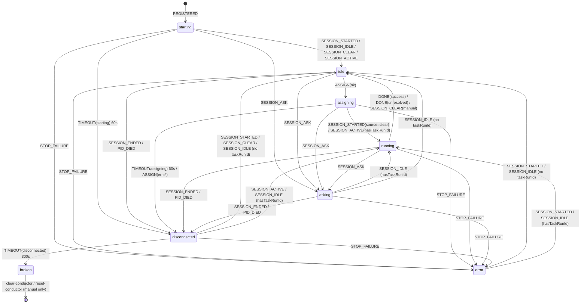
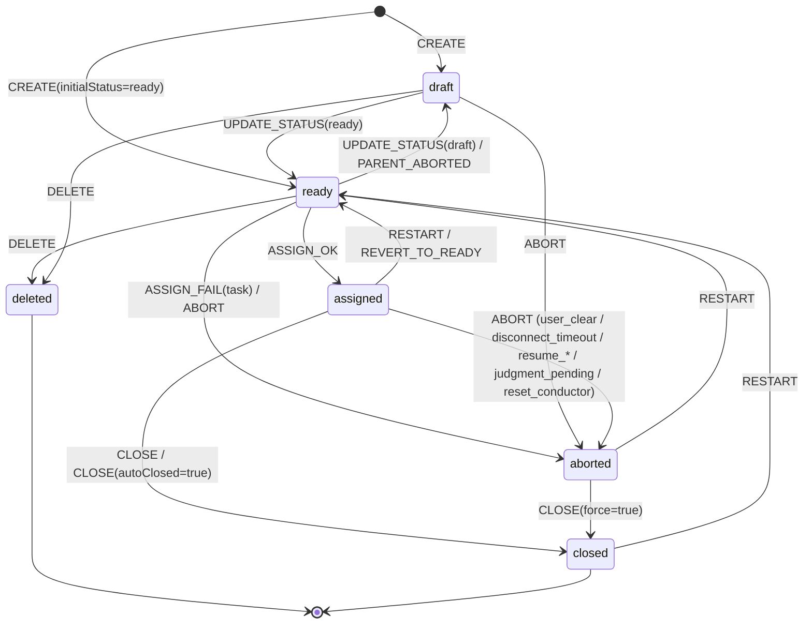

# 07. Conductor / Task state machine

> T279 で追加。Conductor と Task の状態・イベント・遷移を仕様として成文化する。
> 運用時のスナップショット (現状調査) は `.team/artifacts/A017-state-machine.md` を参照。
> 実装は `skills/cmux-team/manager/state-machine/` (pure reducer) と
> `skills/cmux-team/manager/daemon.ts` (実 state mutation)。

## 0. 読み方

- **状態** は Conductor (7 値) / Task (6 値) の 2 軸で独立管理する。
- **イベント** は daemon への入力 (hook / CLI / timer) に対応する。
- **reducer** (`conductor-fsm.ts` / `task-fsm.ts`) は純関数。`shadow.ts` が
  daemon の各ハンドラ末尾から reducer を呼び、期待次状態と実 state を比較して
  `fsm_shadow_diff` ログに記録する (P1 observe mode)。副作用は daemon 側でのみ実行される。
- 本ドキュメントの遷移は **reducer 実装が正**。A017 (調査スナップショット) との
  差分は A017 §5 correction section で管理する。

## 1. Conductor FSM

### 1.1 状態一覧 (9 値)

`schema.ts` の `ConductorState.status` に対応。

| 状態 | 意味 | 入口例 |
|------|------|-------|
| `reserved` | pane だけ作成・claude 未起動 (pid/sessionId 不在)。初回タスク assign で `kill+spawn` を経て `assigning → running` へ遷移 (T421) | `cmdConductor` で pane 確保のみ完了 |
| `starting` | `CONDUCTOR_REGISTERED` 直後。Claude プロセス未確認 | 初回登録 |
| `idle` | タスク割当可能。Claude セッション確立済 | `SESSION_STARTED` 到達 / `resetConductor` |
| `assigning` | `assignTask` が `/clear` 送信済みで SESSION_STARTED 未到達 | `scanTasks` → `assignTask` |
| `running` | タスク実行中 (ユーザー入力/ツール呼び出し/思考中) | `SESSION_STARTED(source=clear)` in assigning |
| `asking` | `AskUserQuestion` 受信 (Notification hook) | `SESSION_ASK` |
| `disconnected` | Claude プロセス不在 / SessionEnd / PID 死 | `SESSION_ENDED` / PID watcher |
| `broken` | disconnected 300s 超過で自動復帰停止 (T250) | `monitorConductors` timeout |
| `error` | StopFailure hook 受信（API エラー確定）— `lastApiError` を伴う (T392) | `STOP_FAILURE` |

`broken` は **終端状態**。`cmux-team clear-conductor` または `cmux-team reset-conductor`（T004、任意状態 → `reserved` の局所復旧 CLI）でのみ解除される。
`error` は次の `SESSION_STARTED` / `SESSION_IDLE` で自然解除される（`lastApiError` も undefined に戻る）。

Master / Agent も同等に `status: "error"` バリアントと `lastApiError` を持つ（`MasterStateSchema` / `AgentState`）。

### 1.2 遷移表

イベント × 現状態 → 次状態の真偽表。`—` は state 遷移なし (no-op)。

| event \ state | `starting` | `idle` | `assigning` | `running` | `asking` | `disconnected` | `broken` | `error` |
|---|---|---|---|---|---|---|---|---|
| `REGISTERED` | — | — | — | — | — | — | — | — |
| `SESSION_STARTED` (not master) | `idle` | — | `running` | — | — | `idle` | — | `running`/`idle` [^1] |
| `SESSION_IDLE` | `idle` | — | — | — | `running`/`idle` [^1] | `running`/`idle` [^1] | — | `running`/`idle` [^1] |
| `SESSION_CLEAR` (daemon) | `idle` | — | — (assigning 維持) | log only | — | `idle` | — | — |
| `SESSION_CLEAR` (manual) | `idle` | — | — (assigning 維持) | `idle` + task abort | — | `idle` | — | — |
| `SESSION_ACTIVE` | `idle` | — | `running` [^2] | — | — | `running` | — | — |
| `SESSION_ASK` | `asking` | `asking` | `asking` | `asking` | — | `asking` | — | `asking` |
| `SESSION_ENDED` (stop) | `disconnected` | `disconnected` | `disconnected` | `disconnected` | `disconnected` | — | — | `disconnected` |
| `SESSION_ENDED` (other) | — | — | — | — | — | — | — | — |
| `PID_DIED` | `disconnected` | `disconnected` | `disconnected` | `disconnected` | `disconnected` | — | — | `disconnected` |
| `TIMEOUT(starting)` | `disconnected` | — | — | — | — | — | — | — |
| `TIMEOUT(assigning)` | — | — | `disconnected` | — | — | — | — | — |
| `TIMEOUT(disconnected)` | — | — | — | — | — | `broken` | — | — |
| `ASSIGN(ok)` | — | `assigning` | — | — | — | — | — | — |
| `ASSIGN(err=task)` | — | — | `disconnected` [^3] | — | — | — | — | — |
| `ASSIGN(err=conductor)` | `disconnected` | `disconnected` | `disconnected` | `disconnected` | `disconnected` | — | — | — |
| `DONE(success=true)` | — | — | — | `idle` [+close_task_auto if assigned] | `idle` | — | — | — |
| `DONE(unresolved)` | — | — | — | `idle` [+abort_task, preserveWorktree] | `idle` | — | — | — |
| `CLEAR_MANUAL` [^4] | — | — | — | `idle` | `idle` | — | — | — |
| `STOP_FAILURE` (T392) | `error` | `error` | `error` | `error` | `error` | `error` | — | — (上書き) |

[^1]: `ctx.hasTaskRunId` が真なら `running`、偽なら `idle` (T181/T263 経路)。
[^2]: `ctx.hasTaskRunId` が真のときのみ `running`。偽なら no-op (assigning 維持)。
[^3]: state が `assigning` のときのみ (daemon.ts R2 保険)。
[^4]: 予約イベント。現在 emit 箇所なし (SESSION_CLEAR.manualUserInitiated で同等表現)。

### 1.3 タイムアウト定数

| 定数 | 既定 | env override | 対応 event |
|------|-----|-------------|-----------|
| `STARTING_TIMEOUT_SEC` | 60 | (なし) | `TIMEOUT(starting)` |
| `ASSIGNING_TIMEOUT_SEC` | 60 | (なし) | `TIMEOUT(assigning)` |
| `DISCONNECT_TIMEOUT_SEC` | 300 | `CMUX_TEAM_DISCONNECT_TIMEOUT_SEC` | `TIMEOUT(disconnected)` |

### 1.4 状態遷移図 (Mermaid)



### 1.5 内部 status × TUI 表示マッピング (T429)

`dashboard.tsx:buildConductorRow` の表示は内部 9 status を以下にマップする。
**`reserved` は `idle` と完全同表示**（ユーザー視点ではどちらも「タスク待機中」であり、
内部的に claude が起動済か未起動かはユーザー操作の判断材料にならないため、
区別を表に出さない）。

| 内部 status | アイコン | ラベル | 色 | 補足 |
|---|---|---|---|---|
| `reserved` | `○` | `[NNN] idle` | dim | `idle` と完全同表示 |
| `idle` | `○` | `[NNN] idle` | dim | — |
| `starting` | `✻` (spinner) | `[NNN] starting…` | CYAN | — |
| `assigning` | `✻` (spinner) | `[NNN] T123 タイトル assigning…` | CYAN | — |
| `running` | `✻` (spinner) | `[NNN] T123 タイトル 5m` | YELLOW | 旧 catch-all `else` を `case "running"` に明示化 |
| `asking` | `⚠` | `[NNN] T123 asking <elapsed>` + `? <質問本文>` | YELLOW | 質問本文は 120 char で truncate |
| `disconnected` | `⚠` | `[NNN] T123 disconnected <elapsed>` | YELLOW | — |
| `broken` | `⨯` | `[NNN] broken <elapsed> use clear-conductor` | RED | `cmux-team clear-conductor` / `cmux-team reset-conductor` で解除 |
| `error` | kind 別 (⏳/🔒/💰/⚡/⚠) | `[NNN] T123 error <kind>` + 80 char message | RED | T392 |
| (未知 status) | (なし) | `[NNN] unknown <status>` | dim | observability 用 fallback。本来到達しない |

**実装上のガード**: `dashboard.tsx:buildConductorRow` は `switch (status)` + `default: const _exhaustive: never = status;` で TS exhaustive check を強制する。
`ConductorState["status"]` ユニオンに新値を追加して dashboard 更新を忘れた瞬間に compile error が出る（T421 で `reserved` が catch-all `else` に流れて `T000` 誤表示になった事故の再発防止）。
仮にすり抜けてランタイムに未知値が降ってきても、`default` が pane に `unknown <status>` を出力するため AI 観察箱として可視化される。

### 1.6 不変条件

| ID | 条件 | 監視位置 |
|----|------|---------|
| C-I1 | `status=running` ⇒ `taskRunId != null` | `checkConductorInvariants` |
| C-I2 | `status=broken` ⇒ `taskRunId == null` | `checkConductorInvariants` |
| C-I3 | `broken` 解除は `clear-conductor` / `reset-conductor`（T004）のみ | reducer は `broken` で全 event no-op |
| C-I4 | `status=error` ⇒ `lastApiError != null` (T392) | reducer 監視は P3 まで shadow only — 本タスクでは daemon の直接 mutation のみ |

違反は `fsm_invariant_violation` ログに出る (P1 は log only、強制修正しない)。

### 1.7 sessionId pre-inject と整合性チェック (T407)

Conductor / Agent の新規セッション起動時、Manager 側で UUID v4 を発行し `--session-id <UUID>` で claude を起動する。

**経路**:

```
cmdConductor / cmdSpawnAgent
    │ 1. crypto.randomUUID() で UUID 発行
    │ 2. claude args に --session-id <UUID> 追加
    │ 3. POST CONDUCTOR_REGISTERED / AGENT_SPAWNED に sessionId 同梱
    ▼
daemon (CONDUCTOR_REGISTERED / AGENT_SPAWNED ハンドラ)
    │ if (message.sessionId && !state.sessionId)
    │   → state.sessionId に格納（基準値）
    │ else if (message.sessionId && state.sessionId !== message.sessionId)
    │   → session_id_mismatch_at_register_late を warn、採用しない（hook 信頼）
    ▼ (Claude 起動)
SessionStart hook (source=startup) → SESSION_STARTED
    │ state.sessionId 未設定 → warn 無し採用（POST 順序逆転の保険）
    │ source=startup で一致 → warn 無し維持
    │ source=startup で不一致 → session_id_mismatch_at_startup を warn + hook 側で上書き
    │ source=clear/compact/resume → warn 無し上書き（既存 T203 経路）
    │ source=undefined → warn 無し上書き（legacy 互換）
```

**`task_sessions` テーブルは append-only**。/clear / /compact 後の追従は `task-state.json` の `sessionId` 更新のみで完結し、テーブルへの UPDATE 経路は導入しない。spawn 時に書かれた `assigned` / `agent_spawned` 行に空でない UUID が入れば、Agent 由来 tool_use の task_id 解決には十分。

**スコープ**:
- Conductor (`cmdConductor`) / Agent (`cmdSpawnAgent`) のみ対応
- Master (`cmdLaunchMaster`) は **scope 外**（`task_sessions` に Master 起動行が無いため、pre-inject の効用が集計に効かない）
- `cmdResume` には `--session-id` を**渡さない**（`--resume` 経路は既存 session を復元するため）

## 2. Task FSM

### 2.1 状態一覧 (6 値)

| 状態 | 意味 | 入口例 |
|------|------|-------|
| `draft` | 下書き (assign されない) | `create-task` デフォルト / 親 abort cascade |
| `ready` | 実行待ち (assignable) | `update-task --status ready` / `restart-task` |
| `assigned` | Conductor に割り当て済 | `assignTask` 成功 |
| `closed` | 正常完了（T295 以降は `deliverable` 必須。CLI 経由は `--deliverable-kind <files\|merged\|pr\|none>`、auto-close 経路は `kind: "none"` を daemon が自動付与） | `close-task` CLI / T274 auto-close |
| `aborted` | 中止 (人為 or 自動) | `abort-task` / 各 cascade |
| `deleted` | 明示削除 (終端) | `delete-task` (draft/ready のみ) |

`closed` / `aborted` / `deleted` は半終端 (restart で `ready` に戻せるのは
`aborted` / `closed` のみ。`deleted` は復活不可な終端)。

### 2.2 遷移表

| event \ state | `draft` | `ready` | `assigned` | `closed` | `aborted` | `deleted` |
|---|---|---|---|---|---|---|
| `CREATE` | `ctx.initialStatus` [^t1] | — | — | — | — | — |
| `UPDATE_STATUS(to=ready)` | `ready` | — | — | — | — | — |
| `UPDATE_STATUS(to=draft)` | — | `draft` | — | — | — | — |
| `ASSIGN_OK` | — | `assigned` | — | — | — | — |
| `ASSIGN_FAIL(kind=task)` | — | `aborted` +cascade | — | — | — | — |
| `ASSIGN_FAIL(kind=conductor)` | — | — | — | — | — | — |
| `CLOSE` | `closed` | `closed` | `closed` | — | — | — |
| `CLOSE(autoClosed=true)` [^t3] | `closed` | `closed` | `closed` | — | — | — |
| `CLOSE(force=true)` [^t6] | `closed` | `closed` | `closed` | — | `closed` | — |
| `ABORT` | `aborted` +cascade [^t2] | `aborted` +cascade [^t2] | `aborted` +cascade [^t2] | — | — | — |
| `DELETE` | `deleted` +cascade | `deleted` +cascade | — | — | — | — |
| `RESTART` | — | — | `ready` [^t4] | `ready` | `ready` | — |
| `REVERT_TO_READY` [^t5] | — | — | `ready` | — | — | — |
| `PARENT_ABORTED` | — | `draft` | — | — | — | — |

[^t1]: T303: 呼び出し側 store が既存 entry に対しては idempotent skip し、新規時のみ reducer に `prev="draft"` (fake) + `ctx.initialStatus` を渡す。reducer は `initialStatus ?? "draft"` を次状態として返す。
[^t2]: T303 R17: reducer 側 log は `task_aborted_core`。wrapper (`markTaskAborted`) は `task_aborted` を別 event 名で emit し二重 emit を避ける。
[^t3]: T303: T274 auto-close 経路の区別。reducer の log event は `task_completed_state_mismatch` (通常 `CLOSE` は `task_closed`)。wrapper (daemon handleConductorDone) は追加 context を載せた `task_completed_state_mismatch` 詳細版と `task_completed auto_closed=true` を別途 emit。
[^t4]: T303: restart-task CLI は assigned → ready も受理 (cmdRestartTask がクリーンアップ後に再キューに戻す正当経路)。
[^t5]: T303: assigned 救済経路 (D1〜D4 / M1 / M3)。reason variant: `worktree_missing` / `launch_failed` / `unmatched` / `unique_violation` / `overflow`。assigned 以外はすべて noop。
[^t6]: `--force` 指定時のみ aborted → closed を許可する救済経路（AI 自動判定の誤りを人間が修正できるようにするため）。reducer の log event は `task_closed_from_aborted`、detail は `prev_aborted_at=<ISO8601>` (元の abortedAt が存在する場合)。`abortedAt` は merge せず残置し、`closedAt` を新規付与することで二重タイムスタンプによる trace 可能性を維持する。cascade なし（子は aborted 時点で既に処理済み）。

### 2.3 状態遷移図 (Mermaid)



### 2.4 cascade ルール (T241)

親タスクが `aborted` / `deleted` に遷移したとき:

- **`ready` 子**: `draft` に戻す (journal: `parent_aborted: <parentId>`)
- **`draft` / `assigned` / `closed` / `aborted` / `deleted` 子**: 変更なし

cascade 発火経路は 8 本 (CLAUDE.md「依存タスクの cascade」参照):

1. `abort-task` CLI
2. `delete-task` CLI
3. Conductor forced close (disconnect timeout)
4. user_clear (手動 /clear)
5. `assign_failed` (worktree 作成失敗等)
6. `resume_marked_aborted` (cmdStart 起動時、T264)
7. `handleConductorDone` unresolved 分岐 (T269)
8. `reset_conductor` (T004、`reset-conductor` CLI で `assigned` レーンを強制 abort)

`AbortReason` union (`task.ts`) は上記 8 本に対応する 7 値 (`user_clear` / `disconnect_timeout` / `resume_marked_aborted` / `assign_failed` / `judgment_pending` / `manual_abort` / `reset_conductor`)。`events-writer.ts:mapAbortReason` は `reset_conductor` を events stream の `other` カテゴリへマップする（CLI 起点の手動操作で、user 介入不要なため）。

### 2.5 依存解決の意味論 (T002)

`depends_on` の解決は **親が `closed` のときのみ** 成立する。

| 親 status | 子 (`ready`, `depends_on=parent`) の executable 判定 |
|---|---|
| `closed` | ✅ executable |
| `aborted` / `deleted` | ❌ block (`closedIds` に含まれない) |
| 未存在 ID (CLI で reject 済) | ❌ block (永久) |
| `draft` / `ready` / `assigned` | ❌ block (まだ closed でない) |

cascade ルール (§2.4) と独立: 親が `aborted` / `deleted` に遷移したとき子は cascade で `draft` に降格するが、**user が再 `ready` 化しても親が `closed` でない限り executable にはならない**。これが本仕様の本質である。

block された子の解除手段:

1. 親を `restart-task` / `close-task --force` (T001) で `closed` に持っていく
2. 子の `--depends-on` を編集して依存先を変更
3. 子を `abort-task` / `delete-task`

**CLI 入力検証**: `create-task --depends-on <ids>` / `update-task --depends-on <ids>` は実行前に各 ID が `.team/tasks/` に実在するか検証し、未存在なら exit 1 (`Error: depends_on task <id> not found in .team/tasks/`)。複数未存在の場合は最初の未存在 ID のみを報告する (`normalizeTaskIdList` の「最初の invalid を報告」既存挙動と整合)。`--force` bypass は無い。

実装上、`closedIds` は `daemon.ts:scanTasks` で `s.status === "closed"` のみで構築される。`isTerminalStatus` (`closed` / `aborted` / `deleted`) は open 集合・`run_after_all` 競合判定・GC 用途で別 axis として使い続ける。

### 2.6 不変条件

| ID | 条件 | 監視位置 |
|----|------|---------|
| T-I1 | `status=assigned` ⇒ `hasConductor=true` | `checkTaskInvariants` |
| T-I2 | `PARENT_ABORTED` は `ready` にのみ作用 | reducer 側の state guard |
| T-I3 | `closedIds = { id : status==="closed" }` (aborted / deleted は含まない) | `daemon.ts scanTasks closedIds 構築` |

## 3. Conductor ↔ Task の同時遷移

両 FSM は独立だが、以下の経路で密に連動する:

| シナリオ | Conductor | Task | 実装 |
|---------|-----------|------|------|
| 割当 | `idle → assigning` | `ready → assigned` | `scanTasks` + `assignTask` |
| 正常完了 | `running → idle` | `assigned → closed` | `close-task` → `CONDUCTOR_DONE success=true` |
| T274 auto-close | `running → idle` | `assigned → closed` | `CONDUCTOR_DONE success=true` + state still `assigned` |
| judgment_pending (T269) | `running → idle` | `assigned → aborted` + cascade | `CONDUCTOR_DONE success=false unresolved=true` (preserveWorktree) |
| user_clear | `running → idle` | `assigned → aborted` + cascade | `SESSION_CLEAR(manualUserInitiated)` |
| disconnect timeout | `disconnected → broken` | `assigned → aborted` + cascade | `forceCloseDisconnectedConductor` |
| 起動時 resume 不可 | (N/A) | `assigned → aborted(resume_*)` + cascade | `applyResumeTransitions` (T264) |
| reset-conductor (T004) | `<any> → reserved` | `assigned → aborted(reset_conductor)` + cascade | `RESET_CONDUCTOR` メッセージ → `markTaskAborted` → `killClaudeProcess` → `resetConductor(reserved)` → `requestWakeup`（`SESSION_CLEAR(running)` 経路と対称） |

## 4. shadow observability 配線

daemon.ts の各ハンドラ末尾で `shadowObserveConductor(...)` を呼び、
reducer 計算結果と実 state を比較する。差分は `fsm_shadow_diff` ログに記録
(state 変更はしない)。

配線箇所:

| 配線箇所 | 対応 event | 備考 |
|---------|-----------|------|
| `handleMessage:SESSION_STARTED` | `SESSION_STARTED` | Master surface は ctx.isMasterSurface で no-op |
| `handleMessage:SESSION_IDLE` | `SESSION_IDLE` | T181 / T277 分岐 |
| `handleMessage:SESSION_CLEAR` | `SESSION_CLEAR(manualUserInitiated)` | running + taskRunId 一致時に manual=true |
| `handleMessage:SESSION_ACTIVE` | `SESSION_ACTIVE` | ctx.hasTaskRunId で分岐 |
| `handleMessage:SESSION_ASK` | `SESSION_ASK` | 全状態 → asking |
| `handleMessage:SESSION_ENDED` | `SESSION_ENDED` | reason=other は no-op |
| `handleMessage:CONDUCTOR_REGISTERED` | `REGISTERED` | 新規/idempotent-skip 両方で `starting → starting` no-op |
| `handleConductorDone` | `DONE` | currentTaskStatus を ctx で渡し T274 分岐 |
| `__testSpawnPidWatcherTick` | `PID_DIED` | PID 死検出時 |
| `monitorConductors(starting)` | `TIMEOUT(starting)` | 60s |
| `monitorConductors(assigning)` | `TIMEOUT(assigning)` | 60s |
| `monitorConductors(disconnected)` | `TIMEOUT(disconnected)` | 300s |
| `scanTasks(assign)` | `ASSIGN(ok)` / `ASSIGN(err=*)` | エラー経路は errorKind で分岐 |

shadow ログフォーマット:

```
[<ts>] fsm_shadow_diff C[<surface>] scope=conductor event=<TYPE> prev=<s> expected=<s> actual=<s>
[<ts>] fsm_shadow_action C[<surface>] scope=conductor type=<action> detail=<json>
[<ts>] fsm_invariant_violation C[<surface>] scope=conductor state=<s> violation=<rule>
[<ts>] fsm_shadow_diff scope=task task_id=<id> event=<TYPE> prev=<s> expected=<s> actual=<s>
[<ts>] fsm_invariant_violation scope=task task_id=<id> state=<s> violation=<rule>
```

### 4.1 Task 側 shadow 配線 (T303)

Task の shadow observer は `state-machine/task-state-store.ts:applyTaskEvent` の
**内部から唯一呼ばれる**。daemon.ts / main.ts の直接 mutation は撤去済みで、
全 task-state 書き込みは store 経由。cascade 子の shadow も `apply-task-actions.ts`
側で一元化されており、配線漏れが構造的に起きない設計。

| 配線箇所 | 対応 event | 備考 |
|---------|-----------|------|
| `task-state-store:applyTaskEvent` (親) | 全 TaskFsmEvent | reducer 呼出後に shadowObserveTask(taskId, prev, event, ctx, next) |
| `apply-task-actions:cascade_children` (子) | `PARENT_ABORTED` | cascade 対象の各 childId に対して呼ぶ (R5) |
| `task-state-store:updateTaskSessionId` | — | status 遷移を伴わないため shadow は呼ばない (reducer scope 外) |

### 4.2 taskId shape invariant (T418)

`task-state.json` のキー (taskId) は `/^\d{1,4}$/`（1〜4 桁の数字列）に正規化されている。
defense-in-depth として:

- **write 時**: `applyTaskEvent` / `updateTaskSessionId` の入口（`withTaskStateLock` の **外側**）で `assertTaskIdShape` が走り、不正 ID は **`Error` を throw** して mutex に入る前に拒否される。
- **load 時**: `task.ts:loadTaskState` がキー regex に合致しない entry を **drop** して `task_state_invalid_key_dropped` を log 出力する。次回の `saveTaskState` で disk から恒久削除される（既存 zombie の自然消滅）。

旧 `daemon.ts::handleTodo` (削除済) が `Math.floor(Date.now()/1000)` を ID として書き込んだ epoch 形式 zombie key（10 桁）の再発を物理的にブロックする目的。`9999` を超える運用に拡張する場合は両側の regex を同時更新すること（`task-state-store.ts:TASK_ID_RE` と `task.ts:TASK_ID_RE_LOAD`）。

## 5. dispatch ガード (run_after_all / exclusive)

`scanTasks` のタスク dispatch ループに先立ち、3 段階のガードが評価される。
評価順序は: throttle → exclusive lock → run_after_all lock → dispatch ループ。

### 5.1 throttle (5h utilization)

`unified5hUtilization >= THROTTLE_5H_THRESHOLD` または pool 経由で admit 候補が
ゼロのとき、`throttled_rate_limit` をログして全 dispatch を停止する。
詳細は token pool 仕様 (`09-token-pool.md`) を参照。

### 5.2 Exclusive lock

| 条件 | 効果 |
|------|------|
| `exclusive: true` のタスクが `assigned` | `executable` (normal) + `runAfterAllExecutable` (RAA) の **全 dispatch を停止** |

`exclusive` は `parseTaskMeta` で `runAfterAll: true` を暗黙に強制する
（drain 待ちセマンティクス）。
log event: `exclusive_lock_active task_ids=<csv> pending=<n>`

### 5.3 run_after_all lock (T398)

| 条件 | 効果 |
|------|------|
| `runAfterAll: true && !exclusive` のタスクが `assigned`、かつ `executable.length > 0` | `executable` (normal) のみ dispatch を停止。`runAfterAllExecutable` (他の RAA) は通す |

T397 で `filterRunAfterAllTasks` の `normalActive` を executable ベースに変更した結果、
**draft が後で ready 化されたタイミングで新 ready chain と既存 RAA が並走する** 可能性が
残った。本 guard はそれを防ぐ。`runAfterAllExecutable` を通すことで、複数の RAA を
順次 drain する semantics は維持される。

実装上は `dispatchTargets` 変数を `allExecutable` から `runAfterAllExecutable` に
切り替えることで、ループ構造を維持しつつ normal のみ抑止する。
log event: `run_after_all_lock_active task_ids=<csv> pending_normal=<n>`

評価順序の安全性: exclusive ⇒ runAfterAll=true (parser 強制) のため、
`assignedExclusiveTaskIds ⊆ assignedRunAfterAllTaskIds`（フィルタを外した場合）。
exclusive guard は `allExecutable.length > 0` で先に return するため、本 guard は
exclusive を二重カウントしない。defense-in-depth として `!t.exclusive` フィルタを付与している。

### 5.4 各 flag の semantics 比較

| flag | drain 発火条件 | assigned 中の挙動 |
|------|---------------|-------------------|
| `--run-after-all` (非排他) | `executable + assignedNormal = 0` (executable ベース、T397) | normal の新規 assignment を停止。他の RAA とは並走可 (T398) |
| `--exclusive` | 同上 (runAfterAll を暗黙包含) | normal + RAA の **全 assignment** を停止 |

## 6. 段階計画

| フェーズ | 範囲 | リリース条件 |
|---------|-----|-------------|
| **P0** | 現状記述 (A017) | 完了 |
| **P1 (T279)** | 仕様成文化 + pure reducer + shadow observer + 136 単体テスト | 24h runtime で `fsm_shadow_diff` = 0 |
| **P2 (T303, 本タスク)** | **Task 側 mutation を reducer 経由一本化**: `applyTaskEvent` / `updateTaskSessionId` 新設、daemon.ts / main.ts の全直接 mutation を置換、in-process mutex で atomic write、T302 暫定ガード撤去、Task 側 shadow を 17 箇所配線 | 24h 実稼働で `fsm_shadow_diff` / `fsm_invariant_violation` / `fsm_shadow_error` すべて **0 件** (1 件でも NG) |
| **P3 (次候補)** | Conductor 側 mutation の reducer 置換 (`reset_conductor` / `close_task_auto` 等の副作用一本化)、CLI ↔ daemon cross-process race の file lock 導入判断 | P2 24h 観測後 |

P2 で達成した SSOT の射程は **daemon プロセス内**。`cmux-team close-task` 等の
CLI 経路は新 Node プロセスで起動されるため in-process mutex では保護されない。
CLI ↔ daemon 間の cross-process race は reducer noop (`ASSIGN_OK` / `CLOSE` / `ABORT`
の guard) で観測的に吸収する方針で、24h 観測の結果次第で file lock 導入を別タスク化する。

### 6.1 T302 脚注

T302 は T220 の assign race (terminal 巻き戻し) を塞ぐ暫定ガードとして
`__testApplyAssignCommit` 内に `isTerminalStatus` チェックを導入した。
T303 で reducer の `ASSIGN_OK` が `state === "ready"` のみ遷移し terminal 状態
(closed/aborted/deleted) では noop を返す挙動に集約され、暫定ガードと
test-only export は撤去された。旧 `assign_skipped_terminal` ログは
`assign_skipped reason=terminal` (terminal race) と `assign_skipped_unexpected`
(scanTasks のバグ / race の兆候) に分離されている。

## 関連

- A017: 運用時スナップショット (現状調査)
- T250: `broken` 状態追加
- T263 / T269: `CONDUCTOR_DONE` の state 遷移
- T264: 起動時 resume 不可検出
- T274: T274 auto-close
- T276 / T277: `SESSION_IDLE/CLEAR` race 修正
- T302: terminal race 暫定ガード (T303 で reducer に吸収)
- T303: Task side SSOT — `applyTaskEvent` / `updateTaskSessionId` 経由一本化
- CLAUDE.md「EventBus ポリシー」「タスク属性」「エラーリカバリ」
