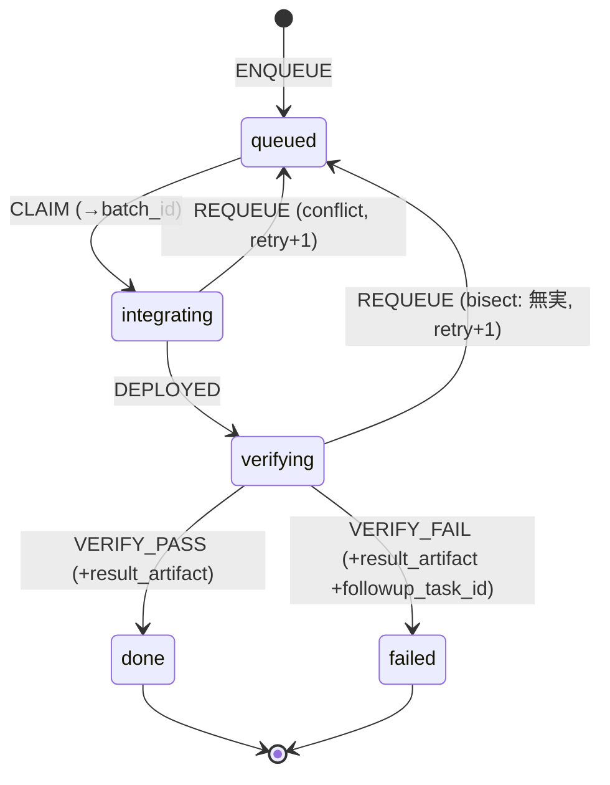

# 17. Integration Queue / Integrator（PoC）

> **Status: Phase 1 PoC 実装済み。** CLI（`elevens integ enqueue|list|show|update`）/ Item FSM（5 値）/ Integrator template / opt-in な Conductor pr 納品注記まで実装し、glossary §13 も同期済み。daemon auto-enqueue / イベント駆動 spawn / staging release-train / deploy guardrail hook は Phase 2（§11）。
> 既存 4 層（Master / Manager / Conductor / Agent）の **後工程（後段の統合レーン）** を担う仕組みを定義する。

関連: [`07-state-machine.md`](07-state-machine.md)（Task / Conductor FSM）/ [`08-runtime-boundary.md`](08-runtime-boundary.md)（Deliverable）/ [`14-epic.md`](14-epic.md)（`/loop` 自律エージェントの先行事例）/ [`16-worktree-archive.md`](16-worktree-archive.md)（cleanup 経路）

---

## 1. 背景と問題

worktree 隔離は **開発（Conductor / Agent）を並列かつ安全**にした。だが、その先の **「共有された唯一の世界」への書き込み** — `main` への merge、deploy、**実機（物理的に 1 台）での E2E**、root フォルダ操作 — には所有者も隔離機構も存在しない。

結果として複数の Conductor が各自の worktree から勝手に deploy・root 操作・main merge を行い、**単一リソースを複数 writer が奪い合う**状態になる。`deliverable: merged`（Conductor が自分で main に merge する）が許されていること自体が、本来直列であるべき統合が並列に漏れ出している症状である。

```
現状: Master(複数) → Task → Conductor(並列, worktree) ──┬─ 各自 deploy ─→ 実機(1台) ← 競合・カオス
                                                       ├─ 各自 main merge
                                                       └─ 各自 root 操作
```

### 物理的制約

実機は 1 台しかなく、**同時 deploy / 同時 E2E は物理的に不可能**。直列化は消せない。問題は「直列化をどう実現するか」ではなく、「**直列な実機アクセスを開発のスループット律速にしない**」こと。

---

## 2. 設計

### 2.1 単一 writer による構造的直列化

統合レーンの actor を **1 つ（Integrator）だけ**にすれば、分散ロック無しで構造的に直列化される（single-writer パターン）。`main` / deploy / 実機 を触れるのは Integrator のみ。Conductor からは deploy / 実機 / main merge 権限を剥奪する。

```
Master(複数) → Task → Conductor(並列, worktree) → close (deliverable=pr)
                                                          │
                                                          ▼  Integration Queue（決定論的・外部化）
                                              ┌──────────────────────────────┐
                                              │  Integrator (単一 /loop)        │  ← 唯一 main/deploy/実機を触る
                                              │  pull → merge → deploy → 実機E2E │
                                              │  → artifact 記録                │
                                              │  → 失敗なら follow-up Task 起票   │
                                              │  → done item を archive          │
                                              └──────────────────────────────┘
```

### 2.2 実機 E2E を merge の critical path から外す

開発スループットを実機で律速しないため、実機 E2E は **非同期・バッチ**で回す（楽観 merge ＋ 後追い検証）。

- **開発（Conductor）**: 並列のまま → dev throughput はここで決まる
- **merge**: 速い・連続的（実機 *不要* の cheap check のみでゲート）
- **実機 E2E**: 非同期バッチ。失敗したら follow-up Task を起票（＝ merge を止める前段ゲートではなく後追いの品質パイプライン）

バッチ化により、直列制約は「**スループットの律速**」から「**検証レイテンシ（結果が出るまでの遅れ）**」に降格する。失敗時はバッチ内 bisect で犯人を特定する。

### 2.3 設計原則との整合（CLAUDE.md）

| 原則 | Integration Queue / Integrator での適用 |
|---|---|
| 上位が下位を監視する（pull 型） | Integrator は closed&PR タスクを **pull** する。Conductor からの push 報告に依存しない |
| 決定論はコード、判断は AI | キュー機構（enqueue / claim / 遷移 / ordering）は決定論（daemon / CLI 強制）。merge / deploy / E2E 解釈 / bisect / follow-up は判断（Integrator） |
| 各層は自分の仕事だけ | Conductor から deploy / 実機 / main merge を剥奪し、Integrator に集約 |
| 逸脱しても安全な構造 | 実機を触れる actor が構造的に 1 つ。worktree 隔離の「世界側」版 |
| **state を外部化** | 統合の in-flight 状態（バッチ所属 / retry 回数 / deploy 済か）を **Integration Queue（外部 file）** に持つ。Integrator は `/loop` cold start で毎回 read する（前回 state を記憶しない） |

> **「agent が前回 state を覚えている前提」を作らない** — `/loop` は wakeup ごとに cold start する。統合の in-flight 状態を Integrator の頭に持たせると CLAUDE.md が *sign of trouble* と呼ぶアンチパターンになるため、明示キューに外部化する。落ちても queue を読めば「どの item が `integrating` / `verifying` のまま放置か」が復元できる。

---

## 3. Integration Item（Task 参照型）

キューの 1 アイテムは **closed かつ `deliverable.kind=pr` の Task への参照**であり、Task そのものではない。

### 3.1 ファイルレイアウト

```
.team/integration-queue/
├── Q001.json      # 単一 JSON ファイル（1 item）
├── Q002.json
└── ...
```

- ID は `Q` + 3 桁 zero-pad（`Q001`〜`Q999`）。Artifact (`A001`) / Epic (`E001`) と同じ lettered-prefix 規約
- terminal item（`done` / `failed`）は GC 対象（既存 `team-gc.ts` の retention パターンに準拠。default 保持日数は config 化）

### 3.2 JSON スキーマ

```jsonc
{
  "id": "Q001",
  "task_id": "142",              // 参照先 Task ID（必須）
  "branch": "task/142-foo",      // 統合対象 branch（必須）
  "pr": 17,                      // PR 番号（optional, deliverable=pr の PR があれば）
  "state": "queued",             // FSM 5 値（§4）
  "batch_id": null,              // claim 時に Integrator が付与（B001 等）。未 claim は null
  "retry": 0,                    // requeue 回数
  "enqueued_at": "2026-06-06T09:00:00.000Z",
  "updated_at": "2026-06-06T09:00:00.000Z",
  "result_artifact": null,       // verifying→done/failed 時に E2E 結果 artifact ID（A0xx）
  "followup_task_id": null,      // failed 時に起票した follow-up Task ID
  "journal": null                // optional prose（判定理由など）
}
```

### 3.3 必須 / Validation

- 必須: `id` / `task_id` / `branch` / `state` / `enqueued_at` / `updated_at`
- `state` は 5 値のいずれか（§4）
- `task_id` は `.team/tasks/` に実在し、かつ `status=closed && deliverable.kind=pr` であること（enqueue 時に検証、不一致は exit 1）
- `id` は `/^Q\d{3}$/`
- `retry` は 0 以上の整数

---

## 4. Integration Item FSM（5 値）

Task FSM（6 値）より小さい。

| 状態 | 意味 | 入口例 |
|------|------|-------|
| `queued` | enqueue 済・未 claim（統合待ち） | enqueue / requeue |
| `integrating` | バッチに claim され、branch を統合ブランチへ merge 済 | Integrator が claim → merge |
| `verifying` | 実機へ deploy 済・E2E 実行中 | バッチ deploy 完了 |
| `done` | E2E pass（**終端**）→ Task を archive | E2E 成功判定 |
| `failed` | E2E fail かつ本 item が原因と特定（**終端**）→ follow-up Task 起票済 | bisect で犯人判定 |

### 4.1 遷移表

| event \ state | `queued` | `integrating` | `verifying` | `done` | `failed` |
|---|---|---|---|---|---|
| `CLAIM`（→batch） | `integrating` | — | — | — | — |
| `DEPLOYED` | — | `verifying` | — | — | — |
| `VERIFY_PASS` | — | — | `done` | — | — |
| `VERIFY_FAIL`（犯人） | — | — | `failed` | — | — |
| `REQUEUE`（無実 / conflict、retry+1） | — | `queued` | `queued` | — | — |

- `done` / `failed` は終端。
- `REQUEUE` は bisect で無実と判定された item、または merge conflict で batch から外した item に使う（`retry` を +1）。
- `VERIFY_FAIL` 時は **`followup_task_id` 必須**、`done` / `failed` 遷移時は **`result_artifact` 必須**（evidence 強制。Epic の hybrid done と同思想）。
- merge conflict は **自動解決しない**（[`07-state-machine.md`](07-state-machine.md) T028 の「conflict は判断必要レポートで停止」と整合）。conflict した item は REQUEUE で batch から外し、follow-up Task で人間 / Conductor に rebase を委ねる。

### 4.2 状態遷移図（Mermaid）



---

## 5. 決定論 vs 判断の境界

| 操作 | 主体 | 種別 |
|---|---|---|
| **enqueue**（closed & deliverable=pr の検出 → 投入） | PoC: CLI 明示（`elevens integ enqueue`） / Phase 2: Manager daemon が `CONDUCTOR_DONE` から自動 | 決定論（コード） |
| ordering（FIFO）/ claim / state 遷移 / retry counter / batch 記録 | CLI 強制（`.team/integration-queue/` 直接書き込みは hook block。Task と同型） | 決定論 |
| バッチ編成・merge・deploy・実機 E2E 実行・結果解釈（pass/fail）・bisect・follow-up 起票 | **Integrator `/loop`** | 判断（AI） |

肝は **enqueue を（最終的に）Manager daemon に持たせる**こと。daemon は既に `CONDUCTOR_DONE` で task close を検出しているため、`deliverable.kind=pr` を検出したら自動で 1 item enqueue する。これが「決定論はコード、判断は AI」の実体化であり、Conductor からの push を不要にする（pull 型維持）。

> **PoC では enqueue を CLI 明示**（`elevens integ enqueue --task 142`）から始め、Phase 2 で daemon auto-enqueue に寄せる。daemon 改修を後回しにできる。

---

## 6. Integrator ロール（`/loop` 自律エージェント）

Epic Planner（[`14-epic.md`](14-epic.md)）と同じ「`/loop` で回す自律エージェント」パターン。Master / Manager / Conductor / Agent の 4 層に対する**後段の単一直列ワーカー**。

### 6.1 runtime モデル

| ロール | 常駐 | 駆動 | 中身 |
|---|---|---|---|
| Master | ○ | 対話駆動 | ユーザー対話・設計（判断） |
| Manager | ○（daemon） | イベント駆動（hook） | 監視・割当（決定論） |
| Conductor | タスク中のみ | 割当駆動 | 1 タスク完遂（判断） |
| Agent | 作業中のみ | Conductor 指示 | 実作業（判断） |
| **Integrator** | PoC: ○ / Phase 2: 必要時 spawn | 間欠 or イベント | キュー drain・統合・実機 E2E（判断） |

> **明示キューによりトリガ選択が load-bearing でなくなる**: PoC は `/loop` が queue を間欠ポーリング、Phase 2 は daemon が enqueue 時に Integrator を起こす。**どちらも同じ durable queue を読み書きするだけ**で、キュー実装を変えずに移行できる。

### 6.2 `/loop` 1 周回の契約

1. **pull**: `state=queued` の item を `enqueued_at` 昇順で集める。空なら何もせず次 wakeup へ。
2. **batch**: 先頭から N 件を `CLAIM`（`batch_id` 付与 → `integrating`）。branch を統合ブランチ（または staging）へ順に merge。conflict した item は `REQUEUE`（batch から除外）＋ follow-up Task。
3. **deploy**: 統合ブランチを実機へ deploy（**唯一ここだけが実機を触る**）。batch の全 item を `DEPLOYED`（→ `verifying`）。
4. **e2e**: 実機 E2E をバッチまとめて 1 回実行。
5. **record**: 結果を artifact に記録（`/elevens:artifact report "実機E2E batch-B003"`）。`result_artifact` に ID を書く。
6. **判定**:
   - **green**: batch 全 item を `VERIFY_PASS`（→ `done`）。各参照 Task を archive（統合完了マーク）。staging 方式なら staging→main を promote。
   - **red**: batch 内を bisect。犯人 item を `VERIFY_FAIL`（→ `failed`）＋ `create-task` で follow-up Task 起票（`followup_task_id` 記録）。無実 item は `REQUEUE`（→ `queued`、次バッチへ）。main を汚した場合は revert PR も起票。
7. **journal**: 判定 evidence を `journal` / artifact に残し次周回へ。

### 6.3 テンプレート

`skills/cmux-team/templates/ja/integrator.md`（作成済み）に上記ループを記述する。Epic Planner template（`epic-planner.md`）と同じ起動法: 別ペインで Claude Code → template 読み込み → `/loop`。

---

## 7. Conductor 境界の変更（opt-in / 非破壊）

Integration Queue を採用するプロジェクトでは、Conductor / Agent から **deploy・実機アクセス・`main` merge を剥奪**し、成果物を **PR 納品のみ**に絞る。これが Integration Queue への entry 条件（`deliverable.kind=pr`）。

ただし **base テンプレートを無条件に pr-only へ変えない**（Integrator を使わない従来プロジェクト＝ローカルマージ既定を壊さないため。CLAUDE.md「既存の動作を壊さない」）。**有効化は per-project の opt-in** とする:

- **base テンプレート**（`conductor-role.md` Step 9 / `conductor.md` Step 4、ja/en 両方）に「**Integrator 運用プロジェクトでは pr 納品のみ・ローカルマージ / deploy / 実機 / main merge 禁止**」の注記を追加済み（条件付き挙動として明記）
- **per-project 有効化**: プロジェクトの conductor overlay (`.team/agent-instructions/conductor.md`) に「Integrator 運用」の指示を置くと、Conductor は常に PR 納品で終える
- overlay に当該指示が無い従来プロジェクトは、引き続きローカルマージをデフォルトにできる（後方互換）

### Phase 2

- worktree セッション（`CMUX_*` env で判定）から deploy 系コマンド / 実機 `ssh` / `git push origin main` を弾く **guardrail hook**（既存 CLI 強制 hook と同型）。overlay の宣言だけに頼らず構造的に強制する

---

## 8. CLI surface（PoC）

```bash
# enqueue（PoC は CLI 明示。closed & deliverable=pr を検証。--force で §3.3 検証を skip）
elevens integ enqueue --task 142 [--pr 17] [--branch task/142-foo] [--force]

# 一覧 / 詳細
elevens integ list [--state queued|integrating|verifying|done|failed|all]
elevens integ show Q001

# 状態遷移（FSM 強制。不正遷移は reject。Task の update-task --status と同型）
elevens integ update Q001 --state <queued|integrating|verifying|done|failed> \
    [--batch B003] [--artifact A045] [--followup 150] [--retry-inc] [--reason "..."]
```

`update` は FSM ガードを強制する:

- 不正遷移（§4.1 で `—`）は exit 1
- `--state done|failed` は `--artifact` 必須
- `--state failed` は `--followup` 必須
- `--state queued`（REQUEUE）は `--retry-inc` で `retry` を +1

---

## 9. 既存 spec / glossary との関係

- [`07-state-machine.md`](07-state-machine.md): Task FSM / Conductor FSM は **影響なし**。Integration Item FSM は独立した第 3 の FSM
- [`08-runtime-boundary.md`](08-runtime-boundary.md): `close-task --deliverable-kind pr` が entry 条件。`deliverable` 型自体は変更なし
- [`14-epic.md`](14-epic.md): Epic Planner と同じ `/loop` 自律パターン。Epic（上から覆う goal layer）と Integration Queue（下から刈り取る後工程 layer）は直交
- [`16-worktree-archive.md`](16-worktree-archive.md): `done` item の Task archive は既存 archive 経路を流用
- `depends_on` cascade（PARENT_ABORTED）: 影響なし
- **glossary**: Integration Queue / Integration Item / Integration Item FSM / Integrator / `elevens integ` を §13 に追加済み（同期完了）

---

## 10. 設計判断（既定 — プロジェクトで上書き可）

| # | 論点 | 既定（PoC） | 上書き条件 |
|---|---|---|---|
| D1 | アイテム粒度 | **per-task ＋ `batch_id` タグ**（1 closed PR = 1 item、Integrator が束ねる。bisect が自然） | — |
| D2 | enqueue 主体 | **PoC は CLI 明示**、Phase 2 で daemon auto-enqueue | — |
| D3 | merge 先 | **`main` 直（楽観 merge）** をデフォルトとする。ユーザーの当初要件「merge → deploy → E2E → 失敗時 follow-up」と一致し、最も単純。実機 E2E は merge を gate せず後追い検証で、regression は follow-up Task で回収する | 「**main を常に実機検証済みに保ちたい**」なら staging release-train（§11）に切替。dev→staging は全速、Integrator が実機バッチ green で staging→main を promote |
| D4 | バッチサイズ N / wakeup 間隔 | **実機 E2E 1 回の所要時間でスケールする可変値**。目安: E2E が数分 → N=1〜2 / 高頻度、数十分〜数時間 → N=大 / 低頻度（自己ペース wakeup）。`.team/config.json` の `integration.batchSize` / `integration.wakeupIntervalSec` で設定（PoC は Integrator の判断に委ねる） | 実機台数・E2E 安定性で調整。実機が複数なら device 単位レーン（§11） |

> D3 を `main` 直に倒した理由: 本 PoC のゴールは「**worktree の無調整 deploy / root 操作のカオスを止める**」こと。これは「実機を触る actor を Integrator 1 つに集約する」ことで達成され、merge 先が main か staging かは独立の選択。まず単純な main 直で動かし、main の一時的な未検証混入が問題になったら staging を挟む段階移行とする。

---

## 11. Phase 2 候補（PoC 後）

- Manager daemon の `CONDUCTOR_DONE`（deliverable=pr）→ **auto-enqueue**
- daemon が enqueue 時に Integrator を **イベント駆動 spawn**（常駐ポーリング廃止）
- staging release-train（dev→staging 全速並列、実機バッチ green で staging→main promote）
- worktree からの deploy / 実機 / main push を弾く **guardrail hook**
- events stream（`.team/logs/events.jsonl`）への integration state 変更 emit
- Web dashboard の integration surface（queue 深さ・バッチ pass 率・実機稼働率）
- bisect 自動化（二分で犯人特定）の戦略確定
